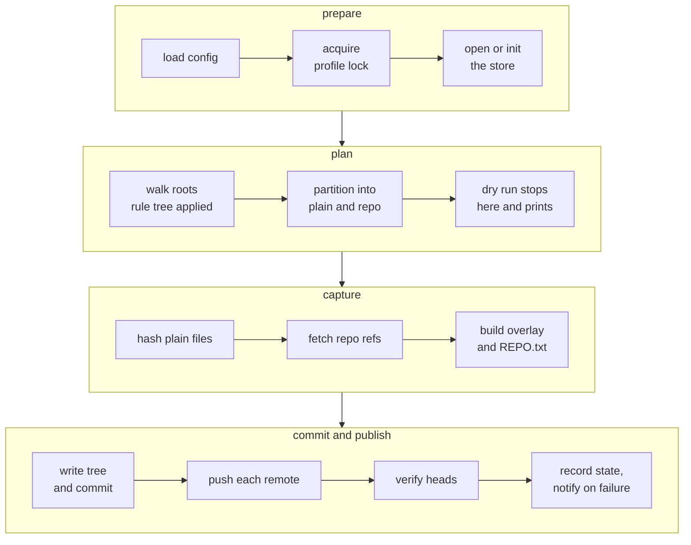

# A run, stage by stage

`tycho run <profile>` is the whole product. Everything else in the CLI either
inspects what a run produced or configures the next one.

## 1. The pipeline



A failure in `prepare` or `plan` aborts before the store is touched. A failure in
`capture` aborts before the ref moves. A failure in `push` leaves a valid local
commit and a remote marked behind - the backup exists, it just has not reached
that destination yet.

## 2. Prepare

The profile lock is a file under the state directory held with
`std::fs::File::lock` for the run's duration. A second `tycho run` on the same
profile blocks rather than interleaving two writers into one store. The lock is
per profile, so two profiles run concurrently without contention.

The store is created on first use with `git init --bare`, plus `gc.auto` left at
its default and `core.logAllRefUpdates` enabled so the reflog records every ref
move - which is what makes an accidental history problem diagnosable.

## 3. Plan

The walk uses the `ignore` crate with **gitignore semantics off**. That crate is
built to honour `.gitignore` by default; every such source is disabled explicitly:

```rust
WalkBuilder::new(root)
    .standard_filters(false)
    .hidden(false)
    .follow_links(false)
    .build()
```

This is invariant 3 from `overview.md` expressed in code, and the reason it is
worth a note in the source: the default behaviour of the walker is the exact
behaviour that lost `CLAUDE.md`.

Each directory entry is classified:

| Entry | Detected by | Result |
|---|---|---|
| Repository root | `.git` directory, or `.git` file for a submodule or worktree | `Entry::Repo`, walk does not descend |
| Excluded | the deepest matching rule is an ignore | skipped, walk does not descend |
| Plain file | anything else that survives the rule tree | `Entry::Plain` |

Both forms of `.git` matter here. Every platform repository under
`~/Developer/CoreEngineX/products` is a submodule, so its `.git` is a file
containing a `gitdir:` pointer. Detecting only the directory form would silently
capture submodules as loose files with no history at all.

Repositories nest. A repo found inside another repo is captured independently and
the outer repo does not descend into it, matching how git itself treats the
boundary. On this machine that is the normal case, not an edge case.

```rust
enum Entry {
    Plain(PlainFile),
    Repo(RepoRoot),
}
```

`tycho run --dry-run` stops here and prints the plan: per root, the file count and
byte total, the repositories found with their current head, and what the rule tree
excluded. This is the command to run before a first real backup, because the store
keeps history forever and a mistake in the ignore rules is permanent.

## 4. Capture: plain files

Paths stream to `git hash-object -w --stdin-paths`, which reads each file once and
writes its blob. Nothing is copied. The returned shas pair back with their paths in
order and become index entries under `<alias>/<relative path>`.

Read failures on individual files - a permissions denial, a file deleted between
the walk and the hash - are recorded as run warnings and do not fail the run. A
file-level backup of a live filesystem is a crash-consistent copy, not a database
snapshot, and one unreadable file is not a reason to lose the other fifty thousand.

## 5. Capture: repositories

Three things happen per repository.

**History**, one fetch into the store's namespace:

```text
git -C <store> fetch --prune <repo> "+refs/*:refs/tycho/<key>/*"
```

**The overlay**, which is the part git cannot restore from history:

```text
git -C <repo> status --porcelain=v1 -z --untracked-files=all --ignored=matching
```

That reports modified tracked files, untracked files, and ignored files. Each is
copied into `<alias>/<repo path>/overlay/<path in repo>` in the store tree.

**The overlay is filtered through the profile's rule tree.** `--ignored` lists
every gitignored path, which on this machine includes `target/` and
`node_modules/` - tens of gigabytes. Without the filter the overlay would swallow
them on the first run and keep them in history forever. The filter is the same rule
resolution used by the walk, so an explicitly watched path inside an ignored
directory still lands in the overlay.

This is where a gitignored `CLAUDE.md` is saved, which is the entire reason the
overlay exists.

**Provenance**, written as `REPO.txt`:

```rust
enum RepoHead {
    Branch { name: BranchName, sha: Oid },
    Detached { sha: Oid },
    Unborn,
}
```

A repository with no commits is `Unborn` - the fetch transfers nothing and the
overlay carries the working tree, which is the only thing there is. A repository in
detached HEAD records the sha. Neither is an error, and neither is representable as
a missing-branch-name string.

## 6. Commit and publish

The tree is written and committed as described in `store.md`, the ref moves, and
only then does the run push. `remotes.md` covers push and verification.

The run record is appended to the state file by writing a new file and renaming it
over the old one, so a crash mid-write leaves the previous state intact rather than
a truncated file.

```rust
enum RunOutcome {
    Ok(RunStats),
    OkPartial { stats: RunStats, lagging: Vec<RemoteLag> },
    Failed(RunError),
}
```

`OkPartial` is the case where the commit landed and at least one optional remote
was unreachable - an external drive that is not plugged in. It exits 0. `Failed`
exits non-zero and fires a desktop notification.

## 7. Interruption

SIGTERM, a logout, or a lid close mid-run: the in-flight git process is allowed to
finish or is killed, the lock is released, and the store's ref has not moved unless
the commit had already completed. The next run starts from the previous commit and
re-captures. There is no partial state to clean up, because the only mutation that
is not append-only is the final `update-ref`.

## 8. Test strategy

| Layer | How |
|---|---|
| Rule tree | Table-driven unit tests on plain values, no filesystem |
| Plan | Temporary directory trees, asserting classification and non-descent |
| Repo capture | Real git repositories built in a temporary directory with dirty, untracked, gitignored and submodule cases |
| Overlay filtering | A repo with a gitignored `node_modules` and a gitignored `CLAUDE.md`, asserting the first is excluded and the second captured |
| Store | Round-trip: run, restore, compare bytes |
| Regression | `git bundle verify` invoked with the working directory set to a non-repository, which is the failure that started this project |
