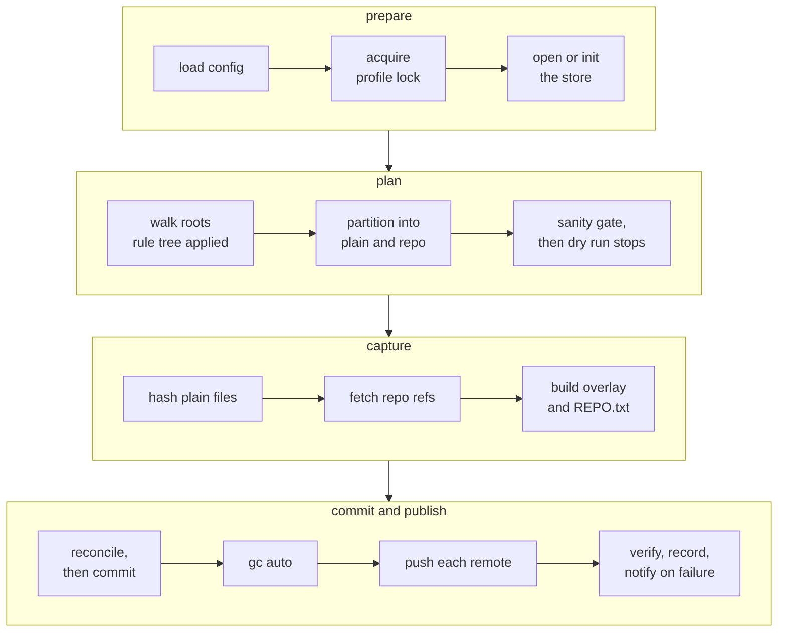

# A run, stage by stage

`tycho run <profile>` is the whole product. Everything else in the CLI either
inspects what a run produced or configures the next one.

## 1. The pipeline



A failure in `prepare` or `plan` aborts before the store is touched. A failure in
`capture` aborts before the ref moves. A failure in `push` leaves a valid local
commit and a remote marked behind - the backup exists, it just has not reached that
destination yet.

## 2. Prepare

The profile lock lives under the state directory and is held with
`std::fs::File::try_lock` for the run's duration.

**The lock covers every command that writes** - `run`, `push`, and the `RECOVERY.md`
write - not `run` alone. All of them mutate the state file, and `push` additionally
runs `gc --auto` against the store. `push` is fired hourly, at login, and on every
filesystem mount, so without this it races a scheduled run.

**It is a try-lock, never a blocking one.** `run` reports "a run is already in
progress since `<time>`" and exits non-zero. `push` exits 0 immediately and does
nothing, because a run in progress is about to push anyway and a queue of blocked
hourly jobs is worse than a skipped one. A blocking lock also converts a single hung
run into permanently silent backups.

The store is created on first use exactly as `store.md` section 2 specifies -
pinned object format, `0700`, explicit `HEAD`, `logAllRefUpdates always`, the three
`never` expiries, and the `info/attributes` neutralisation line. None of those are
optional and none may be inherited from ambient config.

## 3. Plan

The walk is Tycho's own, over `read_dir` and `symlink_metadata`, using an explicit
work stack rather than recursion so a pathological tree depth is not a stack
overflow. Symlinks are never followed, which makes link loops a non-issue.

**The `ignore` crate was rejected**, having been the plan until the rule tree
existed. Its filters are opt-out - the default `WalkBuilder` honours `.gitignore`,
which is the exact behaviour that lost `CLAUDE.md` and the reason D9 exists - and the
descent policy below is not expressible as a filter in any case. What is given up is
its parallel walker; the walk is stat-bound, so that is a real loss, recoverable
later behind a measurement.

**Descent is pruned only where nothing beneath could still be captured.** The obvious
walk stops descending wherever the rule tree says `Skip`, and that silently breaks
re-inclusion: `ignore ~/A/s` with `reinclude ~/A/s/keep` is the documented carve-out,
and stopping at `~/A/s` means `keep` is never reached. The rule tree answers "is there
an explicit capture rule below this directory" instead, and only a no there permits a
prune.

### Two walks, not one

The most confusing part of this design, and an earlier draft got it wrong in a way
that would have silently reduced every submodule to a gitlink:

| Walk | At a repository boundary |
|---|---|
| **Content** - which files become plain-file blobs | **Stops.** A repository's tracked content is captured as history, not as loose files |
| **Discovery** - which repositories exist | **Continues.** It descends into every subdirectory of a repository except its own `.git`, classifying each nested `.git` marker as another repository |

They are one traversal in two modes, which is also what makes it fast. Once inside a
repository, **only directories matter**: its tracked content is captured as history
and its uncommitted content comes from the overlay, so the walk stops stat-ing files
and descends purely to find nested `.git` markers. Measured on the real
`~/Developer/CoreEngineX`, that plans the whole tree - twenty repositories - in under
a second.

Repository discovery is therefore **recursive**. On this machine that is the normal
case: `~/Developer/CoreEngineX/org` is a repository containing four submodules, and
`products/` holds repositories whose platform repositories are themselves submodules.
A discovery walk that stopped at the first boundary would capture `org` and silently
reduce `handbook`, `website`, `brand-assets` and `toolkit` to
gitlink pointers with no history at all.

### Classification

| Entry | Detected by | Result |
|---|---|---|
| Repository root | `.git` directory, or `.git` **file** for a submodule or worktree | `Entry::Repo`; content walk stops, discovery continues |
| Excluded | the deepest matching rule is an ignore | skipped |
| Socket, FIFO, device | `st_mode` | skipped with a warning - see `store.md` section 7 |
| Plain file | anything else surviving the rule tree | `Entry::Plain` |

Both forms of `.git` matter. Every platform repository under
`~/Developer/CoreEngineX/products` is a submodule, so its `.git` is a file
containing a `gitdir:` pointer, and detecting only the directory form would miss all
of them.

```rust
enum Entry {
    Plain(PlainFile),
    Repo(RepoRoot),
}
```

### The sanity gate

**A configured root that resolves to zero capturable entries, or whose own directory
read fails, fails the run.** Not a warning - a `RunError`.

This exists because of a specific failure this project was built to prevent. Under
launchd, macOS TCC can deny the agent access to a watched root. With per-file read
failures treated as warnings, the run would produce a near-empty commit, exit 0, and
record every remote as `Synced` - a green backup containing nothing. That is the
a sibling daemon failure, where the agent ran faithfully and silently moved nothing.

A second gate catches the partial version: **if a root's entry count falls below half
the previous run's, and that previous count was at least 100, the run fails** unless
`--allow-shrink` is passed. `RunStats` is already persisted per run, so the comparison
costs nothing. The floor is there because a root of three files becoming one is noise
rather than a mass deletion; without it the gate would cry wolf on every small root.
A genuine mass deletion is a real event worth confirming once.

`tycho run --dry-run` stops after the gate and prints the plan: per root, the file
count and byte total, the repositories found with their current head, and what the
rule tree excluded. Run it before a first real backup - the store keeps history and
an ignore rule that should have been there cannot be applied retroactively.

## 4. Capture: plain files

Paths stream to `git hash-object -w --no-filters --stdin-paths`, which reads each
file once and writes its blob. Nothing is copied.

The `--no-filters` flag, the path encoding, the concurrency requirement, the
short-read recovery protocol and the post-`write-tree` reconciliation are all
specified in `store.md` section 7. They are not incidental: without them capture
silently stores altered content, silently drops every file after an unreadable one,
or deadlocks.

Read failures on individual files are recorded as run warnings and do not fail the
run - a file-level backup of a live filesystem is a crash-consistent copy, and one
unreadable file is not a reason to lose the other fifty thousand. That policy
applies to **leaf files only**; a root-level read failure hits the sanity gate above.

## 5. Capture: repositories

Three things happen per repository.

**History**, one fetch into the store's namespace, plus the per-entry stash fetch
described in `store.md` section 4:

```text
git -C <store> fetch --no-tags <repo> "+refs/*:refs/tycho/<key>/*"
```

No `--prune`, deliberately - `store.md` section 6 explains why pruning silently
destroys captured history.

**The overlay**, which is the part git cannot restore from history:

```text
git --no-optional-locks -C <repo> status --porcelain=v1 -z \
    --untracked-files=all --ignored=traditional
```

Three flags are each load-bearing:

- **`--no-optional-locks`** keeps the invariant that Tycho never writes to a source.
  Plain `git status` rewrites `.git/index` as a cache update, so without this every
  run modifies every repository it backs up.
- **`--ignored=traditional`**, not `matching`. `matching` collapses an ignored
  directory to a single entry, which makes it impossible to honour a rule that
  re-includes a path inside it - the carve-out this design promises. `traditional`
  enumerates individual files. The cost is that git walks ignored trees such as
  `node_modules`, once per repository per run; that is the price of the carve-out
  being real.
- **`--untracked-files=all`** for the same reason on the untracked side.

**The overlay is filtered through the profile's rule tree**, per file. `--ignored`
reports every gitignored path, which on this machine includes tens of gigabytes of
build output. This filter is why the overlay does not swallow it, and it is why
`traditional` is required - a collapsed directory entry cannot be filtered per file.

**A status entry ending in `/` is a directory that Tycho expands with its own walk,
never copies.** Git reports an untracked nested repository as one collapsed entry;
copying it wholesale would put that repository's `.git` into the store tree as loose
files, which this design explicitly forbids. The expansion classifies any nested
`.git` marker as `Entry::Repo`, feeding the recursive discovery above, so a nested
repository's overlay belongs to *it* rather than to its parent.

**Checked invariant: no path containing a `.git` component is ever written into the
store tree.** It is cheap to assert and it catches this whole class.

This is where a gitignored `CLAUDE.md` is saved, which is the entire reason the
overlay exists.

**Provenance**, written as `.tycho/repos/<key>/REPO.txt`:

```rust
enum RepoHead {
    Branch { name: BranchName, sha: Oid },
    Detached { sha: Oid },
    Unborn,
}
```

A repository with no commits is `Unborn` - the fetch transfers nothing and the
overlay carries the working tree, which is all there is. A repository in detached
HEAD records the sha. Neither is an error, and neither is representable as a missing
branch-name string.

A repository whose object format differs from the store's cannot be fetched at all.
That is a hard per-repo error that fails the run, not a warning - see `store.md`
section 2.

## 6. Commit and publish

The tree is written and committed as `store.md` section 7 describes, the
reconciliation check runs, the ref moves, `gc --auto` runs, and only then does the
run push. `remotes.md` covers push and verification.

The run record is appended to the state file by writing a new file and renaming it
over the old one, so a crash mid-write leaves the previous state intact.

```rust
enum RunOutcome {
    Ok(RunStats),
    OkPartial { stats: RunStats, lagging: Vec<RemoteLag> },
    Failed(RunError),
}
```

`OkPartial` is the case where the commit landed and at least one **optional** remote
was unreachable - an external drive that is not plugged in. It exits 0. A required
remote failing is `Failed`, which exits non-zero and fires a desktop notification
even though the local commit landed, because a backup that has not left the machine
is the condition this project treats as not yet a backup.

## 7. Interruption

SIGTERM, a logout, or a lid close mid-run: the in-flight git process finishes or is
killed by its timeout, the lock is released, and the store's ref has not moved
unless the commit had already completed. The next run starts from the previous
commit and re-captures. There is no partial state to clean up, because the only
mutation that is not append-only is the final `update-ref`.

Note the scope of that guarantee: it covers `refs/heads/main`. The fetch in section
5 moves `refs/tycho/*` before the commit, so an interrupted run can leave captured
refs ahead of the last backup commit. That is safe precisely because nothing is
pruned - the refs are additive, and the next run's commit records them.

## 8. Test matrix

| Layer | How |
|---|---|
| Rule tree | Table-driven unit tests on plain values, no filesystem, covering the truth table in `config.md` section 5 |
| Plan | Temporary directory trees asserting classification, non-descent of the content walk, and recursion of the discovery walk |
| Nested repositories | An outer repository containing a nested one, asserting no `.git` component appears in the tree and the inner repository is captured independently |
| Submodules | The `org` plus four submodules shape, asserting each submodule is captured with history rather than as a gitlink |
| Overlay filtering | A repository with a gitignored `node_modules` and a gitignored `CLAUDE.md`, asserting the first is excluded and the second captured |
| Hostile filenames | Newline, tab, quote, backslash and non-UTF-8 bytes in filenames, through both pipeline legs. APFS rejects a non-UTF-8 filename with `EILSEQ`, so that row is covered by encoder unit tests rather than end to end on macOS, and the filesystem test asserts that the only names it could not create are the non-UTF-8 ones |
| Batch scale | More than 5,000 files, asserting no deadlock. The small fixtures elsewhere cannot reach the threshold |
| Read failure | An unreadable file in the **middle** of the batch, asserting every file after it is present in the tree |
| Byte-exactness | Round-trip with a fixture set containing a CRLF file, an `export-ignore`d path, a filter-attributed path and an `ident` file, comparing bytes with `cmp` |
| Retention | Capture a branch, delete it upstream, re-run, `gc --prune=now`, assert the commit is still readable |
| Sanity gate | A root made unreadable, asserting the run fails rather than committing empty |
| Refnames | A repository under a dot-directory, and one carrying both `Feature` and `feature` |
| Store | Round-trip: run, restore, compare **bytes** - metadata is not preserved, per `store.md` section 7 |
| Regression | `git bundle verify` invoked with the working directory set to a non-repository, the failure that started this project |
