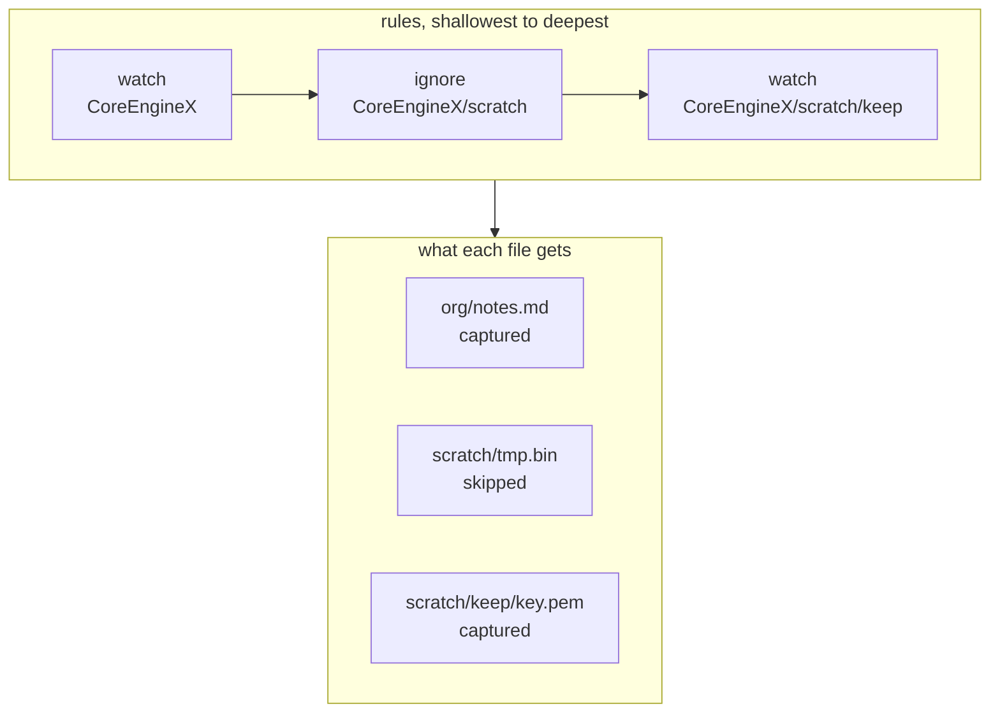

# Configuration and the rule tree

The config file is the single source of truth for what gets backed up. It is
hand-editable, and the commands that modify it preserve comments and formatting.

Location, resolved via the `directories` crate:

| Platform | Path                         |
| -------- | ---------------------------- |
| macOS    | `~/.config/tycho/tycho.toml` |
| Windows  | `%APPDATA%\tycho\tycho.toml` |

`tycho config path` prints it. `tycho config init` writes a starter file with the
detected cloud folders listed as commented-out remotes.

## 1. Why TOML and not JSON

JSON groups nested data more visibly - braces make containment unambiguous - and
that is a real argument, because a profile is exactly the kind of thing you want to
see grouped. Two facts outweigh it:

**JSON has no comments.** This file's most valuable lines are explanations: why a
path is excluded, why a remote is optional, what a schedule is for. A config you
cannot annotate is a config nobody remembers the reasoning for six months later.

**`toml_edit` preserves comments and formatting on write.** `tycho watch add` edits
this file in place. With `serde_json` the file would be reserialised and every
comment, blank line and hand-chosen ordering would be lost the first time you used
a command instead of an editor.

YAML was rejected for whitespace sensitivity and its type-coercion surprises.

The valid part of the JSON argument is addressed by section 2.

## 2. Schema

Every table uses serde `deny_unknown_fields`. An unrecognised key is a hard error,
not a warning. A silently ignored `wacth =` typo is the config-file form of the bug
that made this project necessary.

```toml
# Global settings. The whole table is optional.
[settings]
log_level = "info"                  # error | warn | info | debug

[[profile]]
name = "coreenginex"

watch = [
  "~/Developer/CoreEngineX",
  "~/Books",
  "~/Developer/CoreEngineX/scratch/keep",   # re-included, see section 5
]

ignore = [
  "~/Developer/CoreEngineX/scratch",
  "**/*.xcarchive",
]

remotes = [
  { name = "gdrive",   path = "~/Library/CloudStorage/GoogleDrive-*/My Drive/CoreEngineX-Backups" },
  { name = "onedrive", path = "~/Library/CloudStorage/OneDrive-Personal/CoreEngineX-Backups" },
  { name = "t7",       path = "/Volumes/T7/tycho", optional = true },
]

schedule = { weekly = { day = "sunday", at = "12:00" } }

# use_default_ignores = true
# store_path = "/Volumes/T7/tycho-store"
```

**Remotes are an inline array of tables rather than `[[profile.remote]]` sections.**
That is the grouping fix. With section syntax, a profile's remotes appear *after*
it as separate blocks, and which profile they attach to depends on position in the
file - move a `[[profile]]` header and its remotes silently belong to a different
profile. Inline tables keep everything about a profile inside one contiguous block
that you can select, move or delete as a unit, which is the property JSON's braces
give you.

`tycho config check` echoes the parsed structure back for the same reason:

```text
coreenginex    2 roots, 2 ignores, 3 remotes, weekly Sun 12:00
```

If a remote landed on the wrong profile, that line says so.

### Field reference

| Key | Type | Default | Meaning |
| --- | --- | --- | --- |
| `settings.log_level` | enum | `info` | Verbosity of the log file |
| `profile.name` | string | required | Unique. Names the store directory and the launchd label |
| `profile.watch` | array | required, non-empty | Roots to back up. See section 4 |
| `profile.ignore` | array | `[]` | Paths or globs excluded. See section 5 |
| `profile.remotes` | array | `[]` | Destinations. See `remotes.md` |
| `profile.schedule` | table | none | Exactly one of `daily`, `weekly`, `every`. See `scheduling.md` |
| `profile.use_default_ignores` | bool | `true` | Apply the built-in junk list |
| `profile.store_path` | path | state dir | Where the bare store lives. Point it at an external disk if the internal one is tight |

There is deliberately **no `notify_on_failure` key**. Failure is loud, always. A
setting whose only function is to silence the loudest signal would contradict the
reason this project exists - a year of silent failures is what it was built in
response to. If notifications ever need suppressing on a headless machine, that is
an argument for a `--quiet` flag on a single invocation, not a persistent setting
that a future you forgets is set.

## 3. Profiles: what they are and whether you need two

A profile is **one set of watched paths, sharing one store, one schedule, one set
of destinations, and one restore boundary**. Profiles are fully independent -
nothing is shared between them, not the store, not the remotes, not the lock.

You need exactly one today. The second person's machine does not need a second
profile in *your* config; they have their own machine with their own config file
containing their own single profile. Multi-machine is not multi-profile.

A second profile is worth adding only when one of these is true:

| Reason | Example |
|---|---|
| **The data belongs somewhere else** | Company work goes to the CoreEngineX Google Drive. Personal or school material must not, and no ignore rule can express "back this up but to a different account" |
| **The cadence genuinely differs** | Source trees are worth capturing daily. A 40 GB photo archive is not, and forcing them to share a schedule means picking the wrong one for one of them |
| **Restore should not drag everything along** | Recovering a work directory should not require reasoning about personal files in the same commit |
| **The store belongs on a different disk** | A large archive's store on the T7, everything else on the internal disk |

If none of those apply, a second profile is two stores, two schedules, two launchd
agents and two things to check, for no benefit. Add roots to the profile you have.

**Two profiles can share a destination.** Pointing both at `/Volumes/T7/tycho` gives
that folder `coreenginex.git` and `personal.git` side by side, fully independent -
separate objects, refs, locks and schedules. The only shared resource is disk space,
which `tycho doctor` reports per volume. So "different destinations" as a reason for
a second profile means a different *account or drive*, not a different folder.

The schema keeps profiles as an array so that adding a second later is an edit
rather than a migration, and `tycho run` with no argument is unambiguous while
there is only one.

## 4. Watched roots and aliases

A **watched root** is a top-level directory you handed to Tycho. Everything beneath
it is captured unless a rule excludes it. `~/Developer/CoreEngineX` and `~/Books`
above are two roots.

An **alias** is the short name that root gets *inside the store*. Files are stored
under `<alias>/<path relative to the root>`:

| On your disk | In the store |
|---|---|
| `~/Developer/CoreEngineX/org/notes.md` | `CoreEngineX/org/notes.md` |
| `~/Books/receipts/2026-07.pdf` | `Books/receipts/2026-07.pdf` |

The alias defaults to the root's last path component, so you normally never think
about it.

**Why aliases exist at all.** The alternative is storing the absolute path, which
would make that first file `Users/you/Developer/CoreEngineX/org/notes.md`
in every commit, in every cloud folder. That embeds your username in every path,
makes commit messages unreadable, and means restoring onto a machine with a
different home directory needs path surgery. The alias is the root's stable
identity, independent of where it happens to live on this machine - so moving
`~/Books` to `~/Documents/Books` and updating the config keeps the same history for
the same content, rather than appearing as a total deletion followed by a total
re-add.

**When you have to name one yourself.** Two roots can end in the same component:

```toml
watch = ["~/work/docs", "~/personal/docs"]     # both want the alias "docs"
```

`tycho config check` refuses this rather than guessing, and you disambiguate:

```toml
watch = [
  { path = "~/work/docs",     name = "work-docs" },
  { path = "~/personal/docs", name = "personal-docs" },
]
```

In code this is a sum type, not a struct with an optional name, so "a root without
an alias" and "a root with one" are different shapes rather than one shape with a
maybe-empty field:

```rust
enum WatchEntry {
    Bare(AbsPath),
    Named { path: AbsPath, name: RootAlias },
}
```

Auto-disambiguation was rejected: a generated `docs-2` would move if you reordered
the config, and stored paths have to be stable across runs or history stops lining
up with itself.

Paths accept `~` and `$VAR`. After expansion a path must be absolute; a relative
path is a config error. This is enforced by the `AbsPath` constructor, so no code
downstream can hold an unexpanded or relative path.

## 5. Rule resolution: the deepest rule wins

A watch marks a subtree in, an ignore marks a subtree or a pattern out, and for any
given file **the deepest matching rule on its ancestor chain decides its fate**.
Watch under ignore re-includes. Ignore under watch excludes. Nesting is unbounded.



Which rule decided each: `org/notes.md` has only the root watch above it.
`scratch/tmp.bin` has the root watch and the ignore, and the ignore is deeper.
`scratch/keep/key.pem` has all three, and the inner watch is deepest, so the file
is re-included despite sitting inside an ignored subtree.

Precedence, from weakest to strongest:

1. **Default junk ignores** - weaker than any rule you write, so an explicit watch
   on a `target/` directory wins and captures it.
2. **Glob ignores** - matched at the depth of the file they match.
3. **Path rules** - watch or ignore, ranked by path depth.

Two rules at the same depth on the same path is a config error caught by
`config check`, not a silent tie-break.

### Default junk ignores

Applied unless `use_default_ignores = false`:

```text
node_modules  target  build  .build  dist  .next  .nuxt  .svelte-kit
DerivedData  .gradle  Pods  __pycache__  .venv  venv
*.o  *.pyc  *.class  .DS_Store  Thumbs.db  *.xcuserstate
```

This list is load-bearing rather than cosmetic. `~/.build_caches/cargo` on this
machine is 38 GB; committing it once would put it in the store's history forever.

### Redundancy detection

`tycho watch add PATH` checks whether an ancestor watch already covers the path
with no intervening ignore. If so it reports "already covered by `<ancestor>`" and
changes nothing. If an ignore does intervene, the watch is meaningful - it is a
re-inclusion - and is added. `tycho config check` reports redundant entries that
were added by hand.

## 6. Validation

`tycho config check` runs every one of these and reports all failures at once
rather than stopping at the first:

| Check                                     | Failure                                   |
| ----------------------------------------- | ----------------------------------------- |
| Unknown key                               | error, names the key and the table        |
| Duplicate profile name                    | error                                     |
| Duplicate remote name within a profile    | error                                     |
| Empty `watch`                             | error                                     |
| Relative path after expansion             | error                                     |
| Alias collision                           | error, suggests the `{ path, name }` form |
| Two rules at equal depth on one path      | error                                     |
| More than one of `daily`/`weekly`/`every` | error                                     |
| Watched root does not exist               | warning, the run skips it and records it  |
| Redundant watch                           | warning                                   |
| Remote glob matches nothing               | warning, resolved at run time             |

Exit code 0 with warnings, 1 with any error.

## 7. In-place editing

`tycho watch add|rm` and `tycho ignore add|rm` edit the file through `toml_edit`,
which preserves comments, ordering and whitespace. The file stays something you can
own and hand-edit; the commands are a convenience, not the interface.
