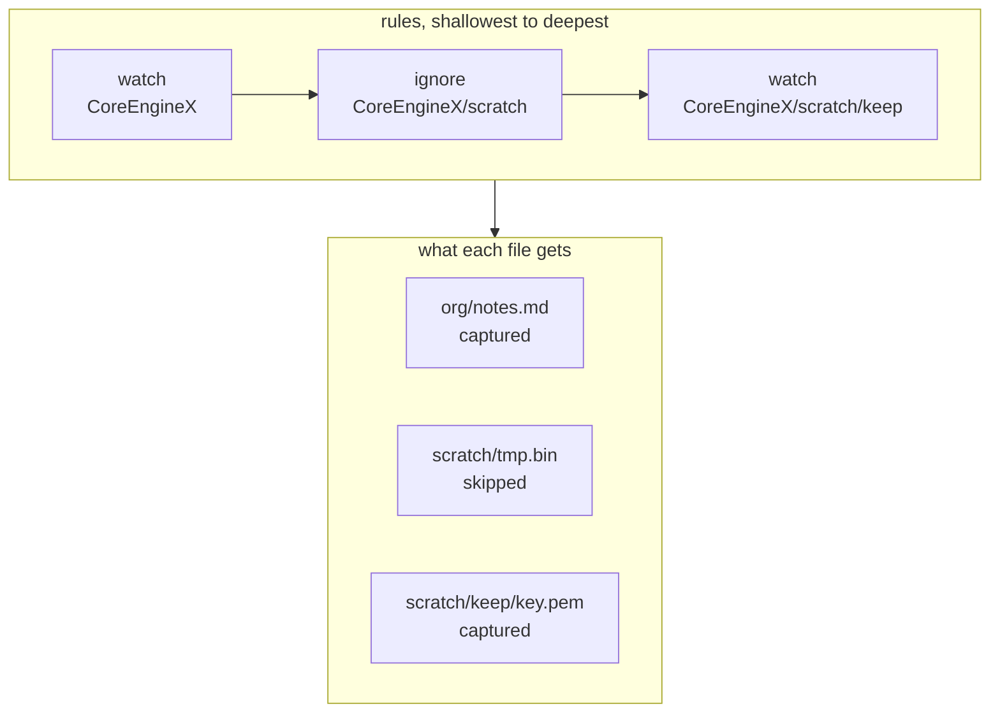

# Configuration and the rule tree

The config file is the single source of truth for what gets backed up. It is
hand-editable, and the commands that modify it preserve comments and formatting.

Location, resolved via the `directories` crate:

| Platform | Path                         |
| -------- | ---------------------------- |
| macOS    | `~/.config/tycho/tycho.toml` |
| Windows  | `%APPDATA%\tycho\tycho.toml` |

`tycho config path` prints it. `tycho config init` writes a starter file with the
detected cloud folders listed as commented-out remotes.

## 1. Schema

Every table uses serde `deny_unknown_fields`. An unrecognised key is a hard error,
not a warning. A silently ignored `wacth =` typo is the config-file form of the bug
that made this project necessary.

```toml
[settings]
log_level = "info"                 # error | warn | info | debug
notify_on_failure = true

[[profile]]
name = "coreenginex"

watch = [
  "~/Developer/CoreEngineX",
  "~/Books",
  "~/Developer/CoreEngineX/scratch/keep",
]
ignore = [
  "~/Developer/CoreEngineX/scratch",
  "**/*.xcarchive",
]
# use_default_ignores = true
# store_path = "/Volumes/T7/tycho-store"

[[profile.remote]]
name = "gdrive"
path = "~/Library/CloudStorage/GoogleDrive-*/My Drive/CoreEngineX-Backups"

[[profile.remote]]
name = "onedrive"
path = "~/Library/CloudStorage/OneDrive-Personal/CoreEngineX-Backups"

[[profile.remote]]
name = "t7"
path = "/Volumes/T7/tycho"
optional = true

[profile.schedule]
weekly = { day = "sunday", at = "12:00" }

[[profile]]
name = "second-company"
```

### Field reference

| Key                           | Type   | Default             | Meaning                                                                 |
| ----------------------------- | ------ | ------------------- | ----------------------------------------------------------------------- |
| `settings.log_level`          | enum   | `info`              | Verbosity of the log file                                               |
| `settings.notify_on_failure`  | bool   | `true`              | Desktop notification when a run fails                                   |
| `profile.name`                | string | required            | Unique. Names the store directory and the launchd label                 |
| `profile.watch`               | array  | required, non-empty | Paths or `{ path, name }` tables. See section 2                         |
| `profile.ignore`              | array  | `[]`                | Paths or globs excluded. See section 3                                  |
| `profile.use_default_ignores` | bool   | `true`              | Apply the built-in junk list                                            |
| `profile.store_path`          | path   | state dir           | Where the bare store lives. Set it to put the store on an external disk |
| `profile.remote.name`         | string | required            | Unique within the profile. Becomes the git remote name                  |
| `profile.remote.path`         | path   | required            | Folder holding the bare repo. May contain one `*` glob                  |
| `profile.remote.optional`     | bool   | `false`             | An unreachable optional remote is BEHIND, not FAILED                    |
| `profile.schedule`            | table  | none                | Exactly one of `daily`, `weekly`, `every`. See `scheduling.md`          |

Profiles are fully independent. Nothing is shared between them - not the store, not
the remotes, not the lock.

## 2. Watched roots and aliases

A watch entry is either a bare path or a table naming it:

```toml
watch = [
  "~/Developer/CoreEngineX",
  { path = "~/Books", name = "books" },
]
```

In Rust this is a sum type, not a struct with an optional name:

```rust
enum WatchEntry {
    Bare(AbsPath),
    Named { path: AbsPath, name: RootAlias },
}
```

The alias names the root's subtree inside the store and appears in commit messages
and restore paths. It defaults to the path's final component. Two roots can share a
final component - `~/work/docs` and `~/personal/docs` both want `docs` - so
**`tycho config check` fails on an alias collision** and tells you to name one
explicitly. It is a config error rather than an automatic disambiguation because a
silently generated `docs-2` would move if you ever reordered the list, and stored
paths must be stable across runs.

Paths accept `~` and `$VAR`. After expansion a path must be absolute; a relative
path is a config error. This is enforced by the `AbsPath` constructor, so no code
downstream can hold an unexpanded or relative path.

## 3. Rule resolution: the deepest rule wins

A watch marks a subtree in, an ignore marks a subtree or a pattern out, and for any
given file **the deepest matching rule on its ancestor chain decides its fate**.
Watch under ignore re-includes. Ignore under watch excludes. Nesting is unbounded.



Which rule decided each: `org/notes.md` has only the root watch above it.
`scratch/tmp.bin` has the root watch and the ignore, and the ignore is deeper.
`scratch/keep/key.pem` has all three, and the inner watch is deepest, so the file
is re-included despite sitting inside an ignored subtree.

Precedence, from weakest to strongest:

1. **Default junk ignores** - weaker than any rule you write, so an explicit watch
   on a `target/` directory wins and captures it.
2. **Glob ignores** - matched at the depth of the file they match.
3. **Path rules** - watch or ignore, ranked by path depth.

Two rules at the same depth on the same path is a config error caught by
`config check`, not a silent tie-break.

### Default junk ignores

Applied unless `use_default_ignores = false`:

```text
node_modules  target  build  .build  dist  .next  .nuxt  .svelte-kit
DerivedData  .gradle  Pods  __pycache__  .venv  venv
*.o  *.pyc  *.class  .DS_Store  Thumbs.db  *.xcuserstate
```

This list is load-bearing rather than cosmetic. `~/.build_caches/cargo` on this
machine is 38 GB; committing it once would put it in the store's history forever.

### Redundancy detection

`tycho watch add PATH` checks whether an ancestor watch already covers the path
with no intervening ignore. If so it reports "already covered by `<ancestor>`" and
changes nothing. If an ignore does intervene, the watch is meaningful - it is a
re-inclusion - and is added. `tycho config check` reports redundant entries that
were added by hand.

## 4. Validation

`tycho config check` runs every one of these and reports all failures at once
rather than stopping at the first:

| Check                                     | Failure                                   |
| ----------------------------------------- | ----------------------------------------- |
| Unknown key                               | error, names the key and the table        |
| Duplicate profile name                    | error                                     |
| Duplicate remote name within a profile    | error                                     |
| Empty `watch`                             | error                                     |
| Relative path after expansion             | error                                     |
| Alias collision                           | error, suggests the `{ path, name }` form |
| Two rules at equal depth on one path      | error                                     |
| More than one of `daily`/`weekly`/`every` | error                                     |
| Watched root does not exist               | warning, the run skips it and records it  |
| Redundant watch                           | warning                                   |
| Remote glob matches nothing               | warning, resolved at run time             |

Exit code 0 with warnings, 1 with any error.

## 5. In-place editing

`tycho watch add|rm` and `tycho ignore add|rm` edit the file through `toml_edit`,
which preserves comments, ordering and whitespace. The file stays something you can
own and hand-edit; the commands are a convenience, not the interface.
