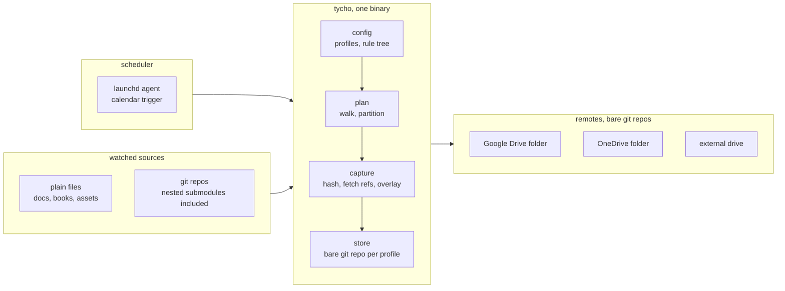
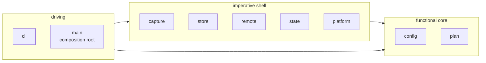

# Tycho architecture - overview

Tycho captures watched paths into a git store and pushes that store to bare
repositories in synced cloud folders and on external drives. One binary, no
resident process, no opaque archive format: every backup is a git commit you can
read, and every remote is a git repository you can clone.

Read `../background.md` for the incidents that produced these requirements and
`../decisions.md` for what was rejected and why. This file is the map; the other
files in this directory are the contracts.

| Doc             | Covers                                                     |
| --------------- | ---------------------------------------------------------- |
| `config.md`     | The TOML schema and the watch/ignore rule tree             |
| `store.md`      | Store layout, ref namespaces, the plumbing commit pipeline |
| `capture.md`    | What a run does, stage by stage                            |
| `remotes.md`    | Push, verification, offline handling                       |
| `cli.md`        | Every command, flag and exit code                          |
| `scheduling.md` | launchd integration and service lifecycle                  |

## 1. Topology

Edge detail kept out of the diagram:

- launchd invokes `tycho run --all`; there is no long-lived process and no IPC.
- Sources are read only. Tycho never writes to, or changes any attribute of, a
  watched file.
- The store to remote edge is `git push` with explicit refspecs, described in
  `remotes.md`.

## 2. Module map

One crate. The four architectural bands are modules rather than crates, per the
house guidance that ceremony scales to project size.

| Module     | Band    | Responsibility                                                                   | Touches IO                 |
| ---------- | ------- | -------------------------------------------------------------------------------- | -------------------------- |
| `config`   | core    | Parse and validate TOML, build and resolve the rule tree, edit the file in place | reads the config file only |
| `plan`     | core    | Walk roots, apply the rule tree, partition into plain files and repos            | reads directory metadata   |
| `capture`  | shell   | Hash files, fetch repo refs, build the overlay, write `REPO.txt`                 | yes                        |
| `store`    | shell   | Bare repo lifecycle, the plumbing commit pipeline, history, restore              | yes                        |
| `remote`   | shell   | Push, first-contact init, post-push verification                                 | yes                        |
| `state`    | shell   | Run records, atomic rename                                                       | yes                        |
| `platform` | shell   | Paths, plist generation, notifications                                           | yes                        |
| `cli`      | driving | clap surface, rendering, exit codes                                              | writes to stdout           |

`config` and `plan` are pure: value types and resolution logic, no side effects
beyond reading. That is what makes the rule tree - the part most likely to have
subtle bugs - testable with plain values and no filesystem.

## 3. Dependency rule

Arrows are dependencies, and they only ever point inward. `config` and `plan`
import nothing from `capture`, `store`, `remote` or `cli`. A violation is
therefore visible as an import, which is the only enforcement a single crate can
offer - if this codebase ever grows a second consumer, the core becomes its own
crate and the compiler enforces it for free.

## 4. What is deliberately absent

Each of these was considered and rejected. `../decisions.md` carries the reasoning.

- **No traits, no ports.** Every seam has exactly one implementation. Tests run
  real git against temporary directories, which is a better test double than a
  mock. A trait goes in when a second remote kind actually exists.
- **No resident daemon.** launchd runs a missed calendar job on wake, which is the
  only thing a scheduler daemon was going to buy.
- **No async runtime.** Nothing here is IO-concurrent in a way that a thread pool
  does not cover.
- **No git library.** Tycho shells out to the system `git`, which is present on
  every machine it targets and is the reference implementation of the format it
  depends on.
- **No encryption, no chunk deduplication, no cloud provider APIs.** A folder is
  the abstraction. Cloud clients sync folders.

## 5. Invariants

These hold across every module and are what the tests exist to defend.

1. **Sources are read-only.** Tycho opens watched files for reading and never
   writes, renames, or changes an attribute on one.
2. **The store advances only on a completed commit.** Every run builds its tree
   and commit in full, then moves the ref as the final step. An interrupted run
   leaves the previous commit as HEAD, never a partial one.
3. **`.gitignore` never affects capture.** The one file the July 2026 incident
   could not restore was gitignored. Exclusions come from the profile config and
   nowhere else.
4. **A file's fate is decided by the deepest matching rule.** Watch under ignore
   re-includes, ignore under watch excludes, to any depth.
5. **One writer per profile.** A lock file held with `File::lock` for the run's
   duration.
6. **Inner `.git` directories are never copied as files.** History is fetched into
   the store's object database as objects.
7. **Failure is loud.** Non-zero exit, a red status line, a desktop notification,
   and a record in the state file. A silent failure is the bug this project
   exists to prevent.
