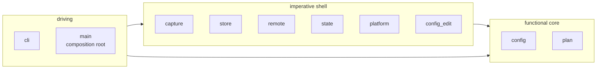

# Tycho architecture - overview

Tycho captures watched paths into a git store and pushes that store to bare
repositories in synced cloud folders and on external drives. One binary, no resident
process, no opaque archive format: every backup is a git commit you can read, and
every remote is a git repository you can clone.

Read `../background.md` for the incidents that produced these requirements,
`../git-primer.md` if refs and refspecs are unfamiliar, and `../decisions.md` for
what was rejected and why. This file is the map; the others are the contracts.

| Doc | Covers |
| --- | --- |
| `config.md` | The TOML schema and the watch/ignore rule tree |
| `store.md` | Store layout, ref namespaces, byte-exactness, the commit pipeline |
| `capture.md` | What a run does, stage by stage |
| `remotes.md` | Push, verification, offline handling |
| `cli.md` | Every command, flag and exit code |
| `scheduling.md` | launchd integration and service lifecycle |

## 1. Topology

Edge detail kept out of the diagram:

- launchd runs **one agent per profile** invoking `tycho run <profile>`, plus one
  shared catch-up agent invoking `tycho push --all`. There is no long-lived process
  and no IPC. `scheduling.md` is the normative source; `run --all` exists as the
  manual and scripted form and is not what the agents use.
- Sources are read only. Tycho never writes to, or changes any attribute of, a
  watched file.
- The store to remote edge is `git push` with explicit refspecs, described in
  `remotes.md`.

## 2. Module map

One crate. The four architectural bands are modules rather than crates, per the
house guidance that ceremony scales to project size.

| Module | Band | Responsibility | Touches IO |
| --- | --- | --- | --- |
| `config` | core | Parse and validate TOML, build and resolve the rule tree | reads the config file |
| `config_edit` | shell | `toml_edit` read-modify-write for `watch`/`ignore` commands | yes |
| `plan` | core | Walk roots, apply the rule tree, partition into plain files and repos | reads directory metadata |
| `capture` | shell | Hash files, fetch repo refs, build the overlay, inspect repo heads | yes |
| `store` | shell | Bare repo lifecycle, the plumbing commit pipeline, history, restore | yes |
| `remote` | shell | Push, first-contact init, post-push verification | yes |
| `state` | shell | Run records, atomic rename | yes |
| `platform` | shell | Paths, plist generation, notifications | yes |
| `cli` | driving | clap surface, rendering, exit codes | writes to stdout |

`config` and `plan` are pure: value types and resolution logic. That is what makes
the rule tree - the part most likely to have subtle bugs - testable with plain
values and no filesystem.

**`config_edit` is a separate module for exactly that reason.** The commands that
rewrite the config file are IO, and folding them into `config` would put a
filesystem write inside the module whose purity the rule-tree tests depend on.

**`--dry-run` calls into `capture` too, not only `plan`.** Its per-repository head
and dirty-state columns cannot come from a metadata walk - they require running git
against each repository. That inspection is a `capture` function the CLI calls after
`plan`, and it uses `git --no-optional-locks status` like every other source probe,
so a dry run does not write to your repositories.

## 3. Dependency rule

Arrows are dependencies and they only ever point inward. `config` and `plan` import
nothing from `capture`, `store`, `remote` or `cli`. A violation is visible as an
import, which is the only enforcement a single crate offers - if this codebase grows
a second consumer, the core becomes its own crate and the compiler enforces it.

## 4. What is deliberately absent

Each was considered and rejected; `../decisions.md` carries the reasoning.

- **No traits, no ports.** Every seam has exactly one implementation. Tests run real
  git against temporary directories, which is a better test double than a mock.
- **No resident daemon.** launchd runs a missed calendar job on wake.
- **No async runtime.** Nothing here is IO-concurrent in a way a thread pair does not
  cover. The one place concurrency is mandatory - reading and writing a child git
  process's pipes at the same time - is two threads, described in `store.md`.
- **No git library.** Tycho shells out to the system `git`, the reference
  implementation of the format the whole design depends on.
- **No encryption, no chunk deduplication, no cloud provider APIs.** A folder is the
  abstraction. Cloud clients sync folders.

## 5. Invariants

These hold across every module and are what the tests exist to defend.

1. **Sources are read-only.** Tycho opens watched files for reading and never
   writes, renames, or changes an attribute on one. Every git command run against a
   source repository passes `--no-optional-locks`, which is what makes this true
   rather than aspirational - plain `git status` rewrites `.git/index`.
2. **The backup ref advances only on a completed commit.** Every run builds its tree
   and commit in full, then moves `refs/heads/main` as the final step. An interrupted
   run leaves the previous commit as HEAD.
   Scope matters: this covers `refs/heads/main`. Capture moves `refs/tycho/*` before
   the commit, so an interrupted run can leave captured refs ahead of the last backup
   commit. That is safe only because nothing is ever pruned, which is why the absence
   of `--prune` in `store.md` section 6 is an invariant and not a preference.
3. **Captured bytes equal disk bytes, and restored bytes equal captured bytes.**
   Enforced by `--no-filters`, the store's `info/attributes`, and pinned config on
   every invocation. Metadata is a separate matter - see `store.md` section 7 for
   what a restore does not preserve.
4. **A run either captures every planned path or names the ones it did not.**
   Enforced by short-read recovery and a post-`write-tree` count reconciliation.
5. **`.gitignore` never affects capture.** The one file the July 2026 incident could
   not restore was gitignored. Exclusions come from the profile config and nowhere
   else. The overlay is derived from `git status --ignored` and then filtered through
   the profile's rule tree - git tells Tycho what exists, never what to keep.
6. **One writer per profile, for the duration of any store or state mutation.** A
   try-lock held by `run`, `push` and the `RECOVERY.md` write alike. Never a blocking
   lock, which would convert one hung run into permanent silence.
7. **A file's fate is decided by the deepest matching rule**, ties broken by tier.
   One algorithm, specified in `config.md` section 5 with a truth table.
8. **Inner `.git` directories are never copied as files.** No path containing a
   `.git` component is ever written into the store tree, and it is asserted rather
   than assumed.
9. **A root that yields nothing fails the run.** A configured root resolving to zero
   capturable entries, or whose own directory read fails, is a `RunError` - not a
   warning. A green empty backup is the failure this project exists to prevent.
10. **Failure is loud.** Non-zero exit, a red status line, a desktop notification,
    and a record in the state file. Notification delivery is itself checked by
    `doctor`, because a channel nobody verified is not a channel.
