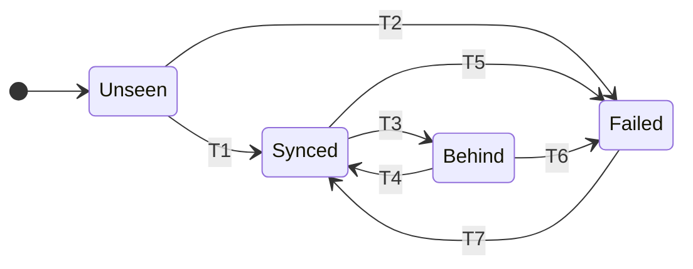

# Remotes

A remote is a folder. Google Drive, OneDrive, an external drive, a NAS mount - all
of them are paths, and the sync client's job is to move what appears there. Inside
that folder Tycho keeps a bare git repository, and publishing a backup is
`git push`.

## 1. Why a bare repo in the folder, rather than files

The cloud sync clients are the hazard here, not the transport. A live git working
tree inside a synced folder means the client watches an index that changes
constantly, a `.git` directory full of lock files, and packs being rewritten under
it. The July 2026 Google Drive incident was a sync client deleting files under a
repository.

A bare repository receives pushes. Between pushes it is static. A push writes new
pack files and then moves a ref, which is close to the friendliest possible write
pattern for something watching the directory.

The local store being the write target of record is what makes this safe: remotes
are replicas that receive completed history. They are never the place a backup is
assembled.

## 2. Push

```text
git -C <store> push <path> "+refs/heads/*:refs/heads/*" "+refs/tycho/*:refs/tycho/*"
```

Both refspecs are required. `git push --all` covers only `refs/heads/*`, so the
captured repository history under `refs/tycho/*` would silently never leave the
machine - a backup that looks green and is missing the majority of what it was
protecting. This is the single most important line in this document.

`--mirror` would carry both, but it also deletes remote refs absent locally, which
turns a misconfigured run into remote data loss. Explicit refspecs, never
`--mirror`.

On first contact the remote folder gets `git init --bare <path>/<profile>.git`. The
glob in a configured path is resolved then - `GoogleDrive-*` matches whatever
account directory exists on this machine - and the first match wins. If the glob
matches nothing, an optional remote is behind and a required remote fails.

## 2a. `RECOVERY.md` beside the repository

Every run writes a `RECOVERY.md` into the remote folder, next to the bare repo:

```text
CoreEngineX-Backups/
  coreenginex.git/
  RECOVERY.md
```

It contains the exact commands to recover from this folder using nothing but git,
with the profile's real paths and captured repository keys filled in, and the date
of the run that wrote it.

This is not documentation for its own sake. In an actual disaster the thing you
still have is a folder in a cloud account, quite possibly opened on a borrowed
machine, and every other copy of the instructions was on the disk that died. A
backup that requires you to remember a procedure is a backup with an undocumented
dependency on your memory.

It is a plain file write into the folder, outside the bare repo and outside the
push. A recovery guide stored *inside* the repository could only be read by
somebody who already knew how to read the repository.

It is also the one thing Tycho writes to a remote that is not a git object, so
`doctor` treats an unexpected file in that folder as a sync artifact and `RECOVERY.md`
as expected.

## 3. Verification

A push that reports success has not proved anything until the remote agrees:

```text
git ls-remote <path>/<profile>.git refs/heads/main
```

The sha must equal the commit just created. Only then is the remote recorded as
`Synced` and only then does `tycho status` print "verified". This exists because
the failure that started this project was a verification step that never actually
ran in the context it claimed to check.

Weekly, and on `tycho doctor`, each reachable remote also gets `git fsck` against
its object database.

## 4. Remote state



| | Transition | Trigger |
|---|---|---|
| T1 | Unseen to Synced | First push succeeds and creates the bare repo |
| T2 | Unseen to Failed | A required remote was unreachable on its first run |
| T3 | Synced to Behind | Unreachable, and the remote is marked optional |
| T4 | Behind to Synced | Reachable again. The next push carries everything missed |
| T5 | Synced to Failed | Push rejected, or the remote head does not match after a reported success |
| T6 | Behind to Failed | An optional remote has been behind past its tolerance |
| T7 | Failed to Synced | The cause was fixed and the next run pushed cleanly |

A `Synced` remote that pushes successfully again stays `Synced`; that self-transition
is omitted from the diagram because it is the unremarkable case.

```rust
enum RemoteState {
    Unseen,
    Synced { at: Timestamp, head: Oid },
    Behind { runs: u32, last_seen: Timestamp },
    Failed { at: Timestamp, reason: FailureReason },
}
```

The count in `Behind` is how many runs have happened since the remote last
received one, which is the number a human actually wants: "that drive is three
backups out of date."

Catch-up needs no special code. A remote that comes back reachable receives the
full history it missed on the next push, because git pushes everything the remote
does not have. An external drive plugged in after a month gets the month.

## 4a. What "unreachable" actually means, and no internet is usually not it

A folder remote on a sync client behaves differently from what people expect,
because **the push is a local filesystem write**. `~/Library/CloudStorage/GoogleDrive-…`
is a mounted path on your disk. Pushing to it does not touch the network.

| Situation | What happens |
|---|---|
| **No internet, Drive folder mounted** | The push succeeds immediately. The Drive client queues the upload and sends it when connectivity returns. Tycho does not wait, retry, or report a problem, because from its side nothing went wrong |
| **Drive app not running, or signed out** | The path does not exist. The remote is unreachable, so `Behind` if optional and `Failed` if required |
| **External drive not plugged in** | Same. The path does not exist |
| **Folder exists but the disk is full** | The push fails. `Failed`, loudly |

So the answer to "what if there is no internet when it backs up" is normally
**nothing waits** - the data lands in the Drive folder on local disk at backup time
and Google receives it whenever the machine is next online. That is the sync
client's job, and duplicating it inside Tycho would mean maintaining a second,
worse upload queue.

**The honest limitation this creates.** Post-push verification compares
`git ls-remote` against the folder, which proves the *folder* has the commit. It
does not prove Google's servers have it, and there is no reliable public API on
macOS to ask a file provider whether an upload finished. A remote reading `verified`
means the bytes are written and handed to the sync client, not that they are in the
cloud.

Two things make that acceptable rather than hand-waved. Multiple remotes fail
independently, so one stalled sync client is not a lost backup. And the external
drive is directly verifiable - there is no client between Tycho and the disk, which
is a large part of what makes an unglamorous USB drive worth having in the list.

## 4b. Catch-up without waiting for the next backup

A remote that was genuinely unreachable - unplugged drive, signed-out account -
would otherwise stay behind until the next scheduled run, which on a weekly
schedule means up to a week with one destination stale while the others are fine.

`tycho push [PROFILE]` closes that. It pushes whatever the store already has to any
remote that is behind, and does no capture at all. With nothing pending it reads the
state file and exits, which costs nothing worth measuring, so it can be triggered
often.

Two triggers, both from `scheduling.md`:

- **`StartOnMount`** - launchd starts the job every time a filesystem is mounted, so
  plugging the T7 in causes the catch-up push within seconds. This is the exact case
  the key exists for.
- **A low-frequency `StartInterval`** - hourly by default, which covers a signed-out
  account that gets signed back in, or a Drive app that was not running.

Neither ever captures. Capture happens on the backup schedule and nowhere else, so
these cannot produce a surprise backup at an unexpected moment - they only move
bytes that were already committed.

## 5. Failure modes

| Situation                               | Behaviour                                                                                                                      |
| --------------------------------------- | ------------------------------------------------------------------------------------------------------------------------------ |
| Optional remote unreachable             | `Behind`, run exits 0, status shows the lag in yellow                                                                          |
| Required remote unreachable             | `Failed`, run exits non-zero, notification fires                                                                               |
| Path exists but is not a git repository | `Failed`. Tycho never initialises over a directory holding other content                                                       |
| Non-fast-forward rejection              | `Failed`. Means another machine pushed to this remote with the same profile. Never force-pushed                                |
| Head mismatch after a successful push   | `Failed`. The push reported success and the remote disagrees, which is the case worth being loudest about                      |
| Sync conflict artifacts in the folder   | `doctor` reports them. Files matching `*conflict*` or `* (1).*` next to a bare repo mean the sync client is fighting something |

One machine per profile per remote. Two machines pushing the same profile name to
one folder will diverge and the second will be rejected rather than merged, because
silently merging two machines' backup histories would produce a history that
describes neither machine. Two machines mean two profile names.

## 6. What a remote costs

The remote holds the same object database as the store, so its size is the store's
size. The first push transfers everything; subsequent pushes transfer only new
objects. A weekly run over a stable tree pushes kilobytes.

For scale on the current machine: the two repositories the old script protected
bundle to 7.7 MB and 112 KB. Under the old scheme each Sunday copied both bundles
in full to both destinations forever. Under this one, an unchanged repository
transfers nothing.
