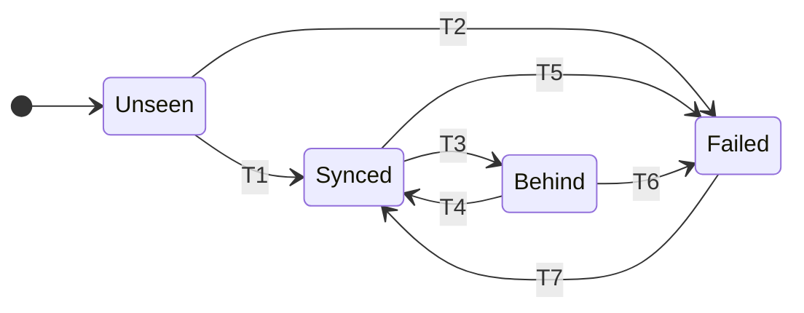

# Remotes

A remote is a folder. Google Drive, OneDrive, an external drive, a NAS mount - all
of them are paths, and the sync client's job is to move what appears there. Inside
that folder Tycho keeps a bare git repository, and publishing a backup is
`git push`.

**On Windows, an exFAT or FAT32 volume is not usable as a remote as things stand,
and an external drive is usually one of those.** Measured against a removable exFAT
volume: `git init --bare` succeeds and leaves a correct repository, and then every
subsequent git command against it fails.

```text
$ git -C D:/backups/demo.git rev-parse --git-dir
fatal: detected dubious ownership in repository at 'D:/backups/demo.git'
'D:/backups/demo.git' is on a file system that does not record ownership
To add an exception for this directory, call:
        git config --global --add safe.directory D:/backups/demo.git
```

That is git's `safe.directory` protection, and it fires on any filesystem with no
ownership to check. The run **fails loudly** - the remote is reported `unusable` and
the run exits 1 - so this is not a silent-backup case. But git's own explanation is
swallowed: the first command Tycho runs after `init` is `git config`, and git answers
a non-repository with `fatal: not in a git directory`, which says nothing about
ownership. **A remote that cannot be used should say why**, and this one does not.

The remedy is the `git config --global --add safe.directory <path>` git prints.
Tycho does **not** add it automatically, and that is a deliberate refusal rather than
an omission: `safe.directory` exists because a repository on removable media can be
attacker-controlled, hooks included, and a backup tool that quietly disables the
protection for any path in a config file is doing the thing the protection is for.
The same volume is also refused as a `store_path`, for a second reason - see
`store.md` section 2 on `NO_ACCESS_CONTROL`.

## 1. Why a bare repo in the folder, rather than files

The cloud sync clients are the hazard here, not the transport. A live git working
tree inside a synced folder means the client watches an index that changes
constantly, a `.git` directory full of lock files, and packs being rewritten under
it. The July 2026 Google Drive incident was a sync client deleting files under a
repository.

A bare repository receives pushes. Between pushes it is static. A push writes new
pack files and then moves a ref, which is close to the friendliest possible write
pattern for something watching the directory.

The local store being the write target of record is what makes this safe: remotes
are replicas that receive completed history. They are never the place a backup is
assembled.

## 2. Push

```text
git -C <store> push --atomic <path>/<profile>.git \
    "refs/heads/*:refs/heads/*" \
    "+refs/tycho/*:refs/tycho/*"
```

Every character of that is deliberate.

**Both refspecs are required.** `git push --all` covers only `refs/heads/*`, so the
captured repository history under `refs/tycho/*` would silently never leave the
machine - a backup that looks green and is missing the majority of what it was
protecting.

**`refs/heads/*` carries no `+`.** Tycho's own backup history is append-only by
construction, so a non-fast-forward there means something is wrong - specifically, it
means a second machine is pushing the same profile name. That must be rejected, and a
leading `+` would instead force it through and destroy the other machine's entire
backup history at exit 0. An earlier version of this document specified `+` on both
refspecs while its own failure table promised "never force-pushed"; the command won.

**`refs/tycho/*` keeps its `+`**, because those refs legitimately track a rewritten
upstream. A rebase or an amend in a source repository moves a captured tip
non-fast-forward, and capture fetches them with `+` for the same reason.

**`--atomic` is not optional.** Without it, per-ref updates are independent: a
rejection on `refs/heads/*` still lets the forced `refs/tycho/*` updates land, so a
rejected push leaves the remote half-clobbered. With it, the whole push fails and
both ref families stay untouched:

```text
error: atomic push failed for ref refs/heads/main. status: 5
 ! [rejected]  main -> main (fetch first)
 ! [rejected]  refs/tycho/r1/heads/main -> ... (atomic push failed)
```

`--mirror` was rejected outright: it carries both families but also deletes remote
refs absent locally, turning a misconfigured run into remote data loss.

**Do not rely on `receive.denyNonFastForwards` as the mechanism.** It protects
`refs/heads/*` only - `refs/tycho/*` is force-overwritten regardless. It is worth
setting as defence in depth, and section 2b does, but the refspec is the fix.

### First contact

The remote path is classified three ways, never as a boolean:

| State | Test | Action |
|---|---|---|
| **Absent or empty** | directory missing, or contains nothing | `git init --bare` and configure it |
| **A valid bare repository** | `HEAD` present, `objects/` and `refs/` present, and `git -C <path> rev-parse --git-dir` succeeds | push |
| **Anything else** | neither of the above | **refuse**, and report which |

The third row exists because `git init --bare` will happily initialise inside a
directory holding your photos and tax returns, and inside a half-synced repository -
in the latter case orphaning the pre-existing pack. The refusal message distinguishes
"holds foreign content" from "looks like an incomplete repository, the sync may still
be downloading", because the remedies differ.

On creation the remote is configured:

```text
git -C <remote> config receive.autogc false
git -C <remote> config gc.auto 0
git -C <remote> config receive.denyNonFastForwards true
git -C <remote> symbolic-ref HEAD refs/heads/main
```

`receive.autogc` is **on by default**, which means a remote would run `git gc` after
receiving a push: packfiles rewritten inside a cloud-synced folder, a corruption
window if the client uploads mid-rewrite, and - worst - the permanent pruning of
anything a forced push orphaned. A remote is a **write-once, append-only replica that
Tycho never compacts.** Its pack count grows; `doctor` reports it, and compaction is
an explicit manual act in the shape of `store.md` section 10.

The `symbolic-ref` line matters for the same reason it does in the store: a remote
whose `HEAD` dangles clones to an empty repository, and cloning a remote is the
disaster path.

### Glob resolution refuses ambiguity

A configured path may contain one `*`, for the account directory whose exact name
you cannot predict:

```text
~/Library/CloudStorage/GoogleDrive-*/My Drive/CoreEngineX-Backups
```

**A glob matching more than one directory is an error, not a coin flip.** The run
fails, lists the matches, and tells you to write the account out in full. Directory
order is not stable - on this machine `OneDrive-Personal` and
`OneDrive-Work` invert between readdir order and sorted order - and
"first match wins" would mean company backups silently landing in a university
account that `background.md` says must never be written to.

A glob matching nothing is a warning for an optional remote and a failure for a
required one.

## 2a. Several profiles can share one destination

The bare repository is named after the profile, so a folder holds as many profiles
as you point at it and they never interact:

```text
/Volumes/T7/tycho/
  coreenginex.git/          one profile's complete history
  personal.git/             another's, entirely separate objects and refs
  RECOVERY.md               covers both
```

Nothing is shared: separate object databases, separate refs, separate locks,
separate schedules. Two profiles may even both call their remote `t7` - remote names
are unique within a profile, not across them.

The one genuinely shared resource is **disk space**, and it matters because the
store keeps full history. `tycho doctor` reports free space per volume rather than
per profile.

This is a different situation from section 5. Two *profiles* sharing a folder is
fine because they are two repositories. Two *machines* pushing the *same profile
name* into one folder is not, because that is one repository receiving two divergent
histories.

## 2b. `RECOVERY.md` beside the repositories

Every run writes a `RECOVERY.md` into the remote folder, alongside the bare repos,
containing the commands to recover from this folder using nothing but git, with real
paths and captured repository keys filled in.

**It describes the folder, not the profile that wrote it.** The writer scans the
folder for `*.git` directories and documents every one it finds, so a folder holding
two profiles gets one file covering both.

Two details make last-writer-wins actually safe rather than merely likely:

- **The content carries no timestamp.** A folder's recovery commands do not expire,
  and a write date would make two writers' output differ for no reason, so the
  content is a pure function of the folder's contents and concurrent writers
  converge by construction.
- **The scan happens immediately before the write**, not at the start of the run, so
  a sibling repository created earlier in the same run is seen.

The write is a temporary file plus a rename. The temp file is named
`RECOVERY.md.tmp.<pid>` and `doctor` knows to expect it alongside `RECOVERY.md`, so
Tycho's own in-flight write is not reported as a sync artifact. **The process id in
that name is load-bearing, not decoration**: a fixed temp name would have two
concurrent writers writing the same file and renaming each other's half-written
bytes into place, which is precisely the convergence the timestamp-free content was
chosen to guarantee.

The commands it writes out are the ones in `disaster-recovery.md`, with the folder's
real paths and keys filled in - including that document's hardest-won correction,
that the branch-and-tag fetch must contain **globs only**. A refspec naming one exact
ref that is absent aborts the whole fetch and recovers nothing at all, so the stash's
top entry is fetched by a separate command where failing means only that there was no
stash.

## 3. Verification

A push that reports success has not proved anything until the remote agrees. The
check compares the **full ref set**, not one ref:

```text
git ls-remote <path>/<profile>.git
```

diffed against `git -C <store> show-ref` filtered to `refs/heads/*` and
`refs/tycho/*`. Every local ref must be present on the remote at the same sha.

Checking only `refs/heads/main` - as an earlier version did - lets a run print
"verified" while the captured repository history failed to land. `--atomic` makes the
partial-push case impossible, and it is the cheap half of the fix, but the full
comparison is what actually verifies the claim being made.

Only then is the remote recorded as `Synced`, and only then does `tycho status`
print `verified`. This exists because the failure that started this project was a
verification step that never ran in the context it claimed to check.

**Integrity checking is opt-in, because on a cloud remote it is expensive.** Files
under `~/Library/CloudStorage` are dataless placeholders materialised on read -
confirmed on this machine with `ls -lO`, which reports `compressed,dataless`. A full
`git fsck` reads every object, so scheduling one weekly would download the entire
backup from the cloud, every week, per remote.

| Check | When |
|---|---|
| `git fsck --connectivity-only` | scheduled, cheap, catches a broken ref graph |
| Full `git fsck` | `tycho doctor --remote <name> --deep` only, after printing "this will download N GB" |

A directly attached drive has no such cost and can be checked in full whenever it is
mounted.

## 4. Remote state



| | Transition | Trigger |
|---|---|---|
| T1 | Unseen to Synced | First push succeeds and the full ref comparison matches |
| T2 | Unseen to Failed | A required remote was unreachable on its first run |
| T3 | Synced to Behind | Unreachable. Applies to required and optional remotes alike |
| T4 | Behind to Synced | Reachable again. The next push carries everything missed |
| T5 | Synced to Failed | Push rejected, or a ref missing or mismatched after a reported success |
| T6 | Behind to Failed | Lag exceeds `behind_tolerance`, which is 1 for a required remote and 4 by default for an optional one |
| T7 | Failed to Synced | The cause was fixed and the next run pushed cleanly |

```rust
enum RemoteState {
    Unseen,
    Synced { at: Timestamp, head: Oid },
    Behind { runs: u32, last_seen: Timestamp },
    Failed { at: Timestamp, reason: FailureReason },
}
```

`Behind` applies to **both** required and optional remotes; the difference is the
tolerance, not the state. A required remote's tolerance of 1 means it fails on the
first missed run, which is the old behaviour, but expressing it as a tolerance
removes the special case and makes `status` able to say `behind 3 of 4`.

A `Synced` remote that pushes successfully again stays `Synced`; that self-transition
is omitted from the diagram because it is the unremarkable case.

**A reachability probe within 60 seconds of the catch-up agent loading does not
transition state.** Cloud File Providers may not have mounted yet at that point, and
a probe against a not-yet-mounted path would otherwise mark every remote `Behind` on
every boot.

## 4a. What "unreachable" actually means, and no internet is usually not it

A folder remote on a sync client behaves differently from what people expect, because
**the push is a local filesystem write**. `~/Library/CloudStorage/GoogleDrive-…` is a
mounted path on your disk; pushing to it does not touch the network.

| Situation | What happens |
|---|---|
| **No internet, Drive folder mounted** | The push succeeds immediately. The Drive client queues the upload and sends it when connectivity returns. Nothing in Tycho retries, waits or reports a problem, because nothing went wrong |
| **Drive app not running, or signed out** | The path does not exist. `Behind`, then `Failed` past tolerance |
| **External drive not plugged in** | Same |
| **Folder exists but the disk is full** | The push fails. `Failed`, loudly |

Verified on this machine against the real `GoogleDrive-…/My Drive`: a first-contact
run initialised the repository, pushed, and passed the full ref-set comparison in
roughly one second at exit 0. The write is local, exactly as claimed.

**A missing folder is unreachable or first contact depending on its parent.** The
configured path not existing means one of two opposite things, and getting it wrong
in either direction is expensive. `/Volumes/T7/tycho` absent while `/Volumes/T7`
exists is a mounted drive that has not been backed up to yet: create it and push.
`/Volumes/T7` itself absent is the drive not being plugged in - `Behind`, and Tycho
must **not** create the path, because macOS removes the `/Volumes` entry on eject, so
creating it would silently write the whole backup onto the boot disk underneath the
mount point and report success. The rule is therefore: create the folder when its
parent exists, treat a missing parent as unreachable.

**The honest limitation.** Verification compares against the folder, which proves the
*folder* has the refs. It does not prove Google's servers do, and there is no reliable
public API on macOS to ask a File Provider whether an upload finished. `verified`
means the bytes are written and handed to the sync client.

Two things make that acceptable rather than hand-waved: multiple remotes fail
independently, so one stalled client is not a lost backup; and the external drive is
directly verifiable, with no client between Tycho and the disk. That is a large part
of why an unglamorous USB drive belongs in the list.

## 4b. Catch-up without waiting for the next backup

A genuinely unreachable remote would otherwise stay behind until the next scheduled
run, which on a weekly schedule means up to a week with one destination stale.

`tycho push [PROFILE]` closes that. It pushes whatever the store already has to any
remote that is behind and does no capture at all. It takes the same profile lock as
`run` and **exits 0 immediately if the lock is held**, since a run in progress is
about to push anyway.

Triggers are in `scheduling.md`: `StartOnMount`, so plugging in the external drive
causes a catch-up push within seconds, and an hourly interval for the rest. Neither
ever captures - **capture happens on the backup schedule and nowhere else**, so what
is in a backup never depends on when you plugged something in.

## 5. Failure modes

| Situation | Behaviour |
|---|---|
| Optional remote unreachable | `Behind`, run exits 0, status shows the lag in yellow |
| Required remote unreachable | `Behind` then `Failed` at tolerance 1, run exits non-zero, notification fires |
| Path holds foreign content | `Failed`. Never initialises over it |
| Path is a partially synced repository | `Failed`, distinguished from foreign content in the message |
| Glob matches more than one directory | `Failed`, matches listed |
| Non-fast-forward rejection on `refs/heads/*` | `Failed`, and with `--atomic` nothing on the remote moved. Never force-pushed |
| A ref missing or mismatched after a successful push | `Failed`. The push reported success and the remote disagrees, which is the case worth being loudest about |
| Sync conflict artifacts | `doctor` reports them - see below |

**One machine per profile name.** Two machines pushing the same profile name into
one folder are two histories arriving at one repository. They diverge, the second is
rejected, and with `--atomic` the remote is left exactly as the first machine wrote
it. Give the second machine a different profile name and it gets its own repository
in the same folder, per section 2a.

### Sync artifacts are scanned inside the repository, not beside it

The damaging artifacts do not sit next to the bare repo, they land inside it. A
duplicated packfile or a conflicted copy of a ref file is the case that silently
corrupts a remote, and git will not always complain.

`doctor` scans the remote folder recursively, including the contents of each
`<profile>.git`:

- any file in `objects/pack/` not matching
  `pack-<hex>.(pack|idx|rev|bitmap|mtimes)` is an artifact
- any file under `refs/` whose name is not a valid ref component is an artifact
- the usual `*conflict*` and `* (1).*` shapes anywhere in the tree
- `RECOVERY.md` and `.RECOVERY.md.tmp` at the folder root are expected, not artifacts

It also reports pack count and total size per remote, which is the number that grows
without bound now that remotes are never compacted.

## 6. What a remote costs

A remote is **append-only and never pruned**, so it holds at least the store's object
database and grows monotonically. It is a superset of the store, not a copy of it:
push never deletes refs, so a ref that leaves the store stays on the remote forever.

That divergence is deliberate. A backup destination that quietly forgot things the
store forgot would be a worse backup. `doctor` reports refs present on a remote and
absent from the store, and `tycho remote prune` exists as an explicit manual act in
the shape of `store.md` section 10 - never as something a scheduled run does.

For scale on the current machine: the two repositories the old script protected
bundle to 7.7 MB and 112 KB. Under the old scheme each Sunday copied both bundles in
full to both destinations forever. Under this one, an unchanged repository transfers
nothing.
