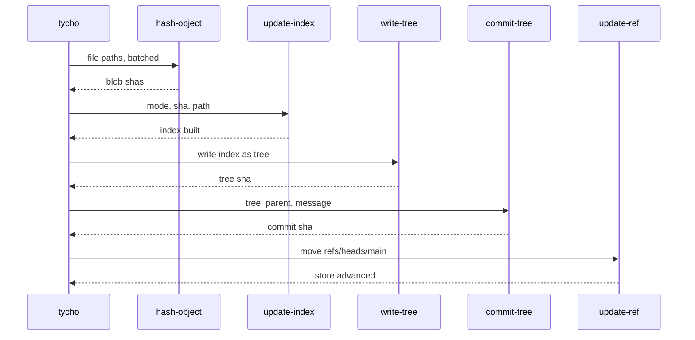
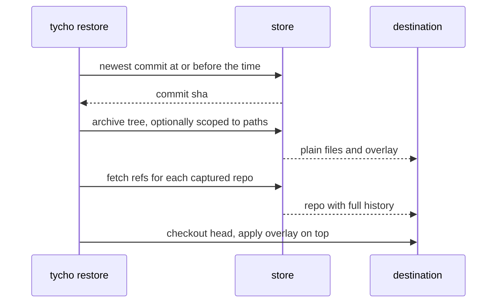

# The store

One bare git repository per profile. It holds every backup ever taken: plain files
as trees on `refs/heads/main`, captured repository history as objects reachable from
`refs/tycho/*`. Nothing about it is Tycho-specific - it is a git repository, and
`git log`, `git show` and `git clone` all work on it directly.

Default location, overridable per profile with `store_path`:

| Platform | Path |
|---|---|
| macOS | `~/Library/Application Support/tycho/store/<profile>.git` |
| Windows | `%LOCALAPPDATA%\tycho\store\<profile>.git` |

**The store is secret-bearing.** It contains copies of gitignored files, which is
the whole point of the overlay, and gitignored is where secrets live. It is created
mode `0700` and Tycho refuses to open one that is group- or world-readable.

## 1. Why bare

The store has no working tree. Files are hashed straight from the source into the
object database, so the local disk cost is the compressed object database and
nothing else - not a second full copy of your data. It also removes checkout as a
failure mode: there is no working tree to be left dirty by an interrupted run.

## 2. Store creation

Every setting below is load-bearing. A store created without them is silently
wrong rather than broken, which is worse.

```text
git init --bare --object-format=sha1 --shared=0600 -b main <store>
git -C <store> symbolic-ref HEAD refs/heads/main
git -C <store> config core.logAllRefUpdates always
git -C <store> config gc.pruneExpire never
git -C <store> config gc.reflogExpire never
git -C <store> config gc.reflogExpireUnreachable never
printf '* -text -diff -filter -ident -export-subst -export-ignore\n' > <store>/info/attributes
```

| Setting | Why |
|---|---|
| `--object-format=sha1` | Never inherit it. A SHA-256 store cannot fetch from a SHA-1 source and vice versa, so the format is pinned at creation and a source repository whose format differs is a hard per-repo error that fails the run |
| `--shared=0600` | Yields `drwx------`. The store holds gitignored content |
| `-b main` plus the explicit `symbolic-ref` | Without it `HEAD` follows the ambient `init.defaultBranch`, and a store whose `HEAD` dangles clones to an empty repository. The explicit form does not depend on the user's config being set the way ours happens to be |
| `core.logAllRefUpdates always` | Plain `true` creates reflogs for `refs/heads/*` only, so `refs/tycho/*` - the refs whose movement you would actually need to diagnose - would have no reflog at all |
| `gc.pruneExpire never` and both reflog expiries | Git's defaults are two weeks and 30/90 days. Inheriting them means captured history silently evaporates on those schedules. See section 6 |
| `info/attributes` | The attribute neutralisation described in section 3. It is the highest-precedence attributes source and it is what makes capture and restore byte-exact |

Never rely on the ambient environment for any of these. **Every git invocation
against the store additionally pins config on the command line:**

```text
git -c core.autocrlf=false -c core.eol=lf -c core.attributesFile=/dev/null \
    -c user.name=tycho -c user.email=tycho@localhost -C <store> ...
```

The identity pin matters for its own reason: `commit-tree` inherits the user's
identity config and hard-fails under `user.useConfigOnly=true`, so a backup would
depend on ambient config being present and would record whoever happened to be
configured.

## 3. Byte-exactness, and why it needs three separate mechanisms

**Invariant: the blob stored for a plain file is `cmp`-identical to the bytes on
disk, and the bytes a restore produces are `cmp`-identical to the blob.**

That invariant is not free. `git hash-object -w` applies gitattributes and clean
filters, and `git archive` applies them again on the way out, so all three of these
are real and were each demonstrated:

| Mechanism | Without it |
|---|---|
| `hash-object -w --no-filters` | `core.autocrlf` or a global `* text=auto` stores a CRLF file LF-normalized. A git-lfs `clean` filter replaces the file's content with a 130-byte pointer |
| `info/attributes` in the store | A `.gitattributes` **captured into the store's own tree** - an ordinary watched file - makes `git archive` drop `export-ignore`d paths outright and rewrite `export-subst` and `ident` content, at exit 0, while `git ls-tree` still lists the file that was not extracted |
| Pinned `-c` config on every invocation | Belt and braces for the invocations that take neither of the above |

**Line endings are a risk on the way in, not on the way out.** An earlier version of
this table blamed `info/attributes` for that too. Measured: a blob holding CRLF
archives back as CRLF whether or not `info/attributes` exists, because `core.eol`
defaults to `native` and native on macOS is LF, so `text=auto` has nothing to convert
on extraction. What actually damages line endings is `hash-object` on the way in,
which `--no-filters` handles - row one, and the row `tests/byte_exactness.rs` proves.
The archive-side traps are `export-ignore`, `export-subst` and `ident`, and those are
real: `tests/restore.rs` runs a restore from a mirror clone with the mechanism removed
and watches all three fire.

The second one needs no unusual configuration anywhere. Any repository you back up
that contains a `.gitattributes` arms it.

**`info/attributes` does not survive `git clone --mirror`.** It lives in the store
directory, not the object database, so it is neither pushed to remotes nor cloned
from them. A restore performed from a remote clone - which is the entire disaster
path - re-exposes the bug. Both `tycho restore --store` and the manual procedure in
`../disaster-recovery.md` therefore re-establish it in the clone before extracting
anything.

## 4. Ref layout

```text
refs/heads/main                        the backup history, one commit per run
refs/tycho/<key>/heads/<branch>        a captured repo's branches
refs/tycho/<key>/tags/<tag>            its tags
refs/tycho/<key>/remotes/<remote>/...  its remote-tracking refs
refs/tycho/<key>/stash                 its top stash entry
refs/tycho/<key>/stashes/<n>           the whole stash stack, one ref each
```

`<key>` identifies a captured repository: the root alias, then the repo's path
relative to that root. `~/Developer/CoreEngineX/org/handbook` under a root
aliased `CoreEngineX` becomes `CoreEngineX/org/handbook`.

### Refname encoding

Do not enumerate git's rules by hand - they are longer than they look and the list
in an earlier draft of this document was incomplete. The rule is mechanical:

**Percent-encode every byte outside `[A-Za-z0-9._-]`, including `%` itself, then
validate the finished refname with `git check-ref-format` and fail the run loudly if
validation fails.**

Two cases the encoder must handle beyond the charset, because they are legal bytes
in illegal positions: a leading `.` in any component (a repo under `~/.config/nvim`
produces one, and git rejects it) and a `.lock` suffix.

**Case and Unicode collisions are detected, not left to the filesystem.** Loose refs
are files, so on APFS a repository carrying both `Feature` and `feature` maps two
branches onto one path. Git errors on first exposure but the *next* fetch is silent
and clobbers the captured tip. Before each fetch, case-fold and NFC-normalise every
destination refname and fail loudly on a duplicate.

The two halves of a destination refname need the fold for different reasons.
Percent-encoding leaves `<key>` pure ASCII, so only case can collide there. The
branch and tag tail is copied from the source unencoded, so it carries whatever the
source repository holds - and a repository created on a case-sensitive, normalisation
-preserving filesystem can hold both the composed and decomposed forms of one name.
That tail is the only place normalisation folding can fire.

### Capturing a repository

```text
git -C <store> fetch --no-tags <repo-path> "+refs/*:refs/tycho/<key>/*"
```

`refs/*` deliberately includes remote-tracking refs, and it also carries `refs/stash`
onto `refs/tycho/<key>/stash`, which is the top entry for free.

The rest of the stack needs separate handling, because it lives in a reflog that
fetch never transfers. Each entry is enumerated with
`git -C <repo> rev-parse 'stash@{N}'` and fetched by object id into
`refs/tycho/<key>/stashes/<n>`.

**`stashes/`, not `stash/`, and the difference is load-bearing.** The wildcard has
already made `refs/tycho/<key>/stash` a *leaf* ref, and git's ref store refuses to
hold a leaf and a directory of the same name - so writing `stash/0` beneath it fails
with "unable to update local ref". An earlier version of this document specified both
and could not have worked.

Fetching those entries does work despite nothing referencing them: over local
transport git reads the source's object database directly, so an unreachable stash
commit transfers without `uploadpack.allowAnySHA1InWant`. Verified.

`HEAD`'s reflog and `ORIG_HEAD` are not transferred, and section 8 says so.

**`--no-tags` is load-bearing, not tidiness.** Without it git auto-follows tags into
the store's *own* `refs/tags/`, on top of the copy the explicit refspec already
places under `refs/tycho/<key>/tags/`. Two captured repositories that both tag
`v1.0` would then fight over one ref in the store, last fetch winning.

**There is deliberately no `--prune`.** See section 6.

## 5. Tree layout on `refs/heads/main`

```text
<alias>/<path relative to the root>                plain files, mirrored
.tycho/repos/<key>/REPO.txt                        provenance for a captured repo
.tycho/repos/<key>/overlay/<path in repo>          what git alone cannot restore
```

All Tycho metadata lives under one reserved top-level entry. An earlier layout put
`REPO.txt` and `overlay/` beside the captured repository's own path, where both are
ordinary names a user's data can already occupy. One reserved name at the tree root
is far easier to defend, and `.tycho` as an alias is a config error.

A directory that is itself a git repository does not appear under `<alias>/` as its
tracked files - those live in the object database, reachable from `refs/tycho/`.

`REPO.txt` is one screen of plain text, and it carries the branch list because
section 6 makes it the record of what existed rather than the ref set:

```text
origin    git@github.com:CoreEngineX/handbook.git
head      main @ 1930b99a
state     clean
branches  main, dev, fix/parser-eof
tags      v1.0, v1.1
stash     2 entries
seen      2026-08-02 12:00
```

## 6. Retention: why there is no `--prune`

Captured history is reachable **only** through `refs/tycho/*`. The store's own
commits contain plain files, the overlay and `REPO.txt` - they do not contain the
captured repositories' commits. So a pruned ref is not "still reachable from older
backup commits"; nothing references it at all, and it becomes garbage.

That was demonstrated: delete a merged feature branch upstream, run again with
`--prune`, and the branch's unique commits are unreachable immediately. Plain `gc`
and `gc --auto` leave them, but a gc past `gc.pruneExpire` destroys them - so with
git's defaults the promise "full history forever" was true for two weeks. The same
applies to every commit an amend or rebase orphans, which is precisely the "I
destroyed my work with a bad rebase" case a backup exists for.

Two changes close it, and both are in section 2:

1. **No `--prune` on the fetch.** The `refs/tycho/<key>/*` set grows monotonically.
   A branch deleted upstream keeps its ref here forever, which is what a backup
   should do. Liveness is recorded in `REPO.txt`'s branch list and its `seen` date,
   not by ref deletion.
2. **`gc.pruneExpire never`** plus both reflog expiries, pinned at creation so
   nothing inherits git's defaults or the user's global config.

The cost is ref sprawl in long-lived repositories, and it is real: a repo with a
thousand historical branches keeps a thousand refs. `git pack-refs --all` keeps that
cheap to read, and `doctor` reports the count per captured repository.

`git gc --auto` runs **after the commit lands**, not after the push. The commit is
what created the loose objects, and tying compaction to a successful push means a
store whose remote is offline never compacts at all.

## 7. The commit pipeline

Git plumbing against a temporary index, in batch: two processes handle every file
rather than two per file.



```text
git -C <store> hash-object -w --no-filters --stdin-paths < paths
git -C <store> update-index -z --index-info < entries
git -C <store> write-tree
git -C <store> commit-tree <tree> -p <parent> -m <message>
git -C <store> update-ref refs/heads/main <commit>
```

`GIT_INDEX_FILE` points at a temporary index built from scratch each run, so a stale
index can never contribute a stale entry.

**The order of those five commands is enforced by the type system**, not by the fact
that they appear in this order. Each step consumes the previous step's state and
produces the next, and every transition goes through one `advance` bounded on a
sealed `After` marker - so publishing a ref before the tree has been reconciled is
not a bug to catch in review but a program that does not compile. The chain is
declared once, as a chain:

```text
Locked -> Planned -> Hashed -> Captured -> Indexed -> Treed -> Reconciled
       -> Committed -> Published -> Mirrored -> Recorded
```

`Mirrored` sits between `Published` and `Recorded` in both directions for a reason.
After `Published`, because a remote must never hold a commit the store itself has not
adopted. Before `Recorded`, because the run's outcome depends on what the remotes
did - a commit that never left the machine is the condition this project treats as
not yet a backup, so it cannot be written down as a success before the push is known.

### The two legs use different path encodings, deliberately

This is the sharpest edge in the whole pipeline and it must be stated rather than
rediscovered:

| Leg | Encoding | Because |
|---|---|---|
| `hash-object --stdin-paths` | newline-delimited, C-quoted when a path contains a byte outside the safe set | It has no `-z`. A raw newline in a filename otherwise splits one path into two |
| `update-index -z --index-info` | NUL-delimited raw bytes | `-z` exists here, and without it a path beginning with `"` is silently dequoted and any path containing a `.git` component is silently discarded - both at exit 0 |

An implementation that uses one encoding for both legs is silently wrong.

### Concurrency: the pipeline deadlocks if written naively

`hash-object --stdin-paths` must have its stdin written and its stdout read
**concurrently** - a writer thread and a reader thread, or async. Writing every path
and then reading fills the OS pipe buffer and both sides block forever. It was
measured wedging at roughly 2,300 files with 145-byte paths, and the threshold
scales with path length, so it is reachable on any real backup. Feeding stdin from a
file removes half the hazard but a spawn-wait-read implementation still hangs at
5,000 files.

Chunking well under the pipe buffer with a full drain between chunks is an
acceptable alternative.

**Every child git process runs under a timeout**, so any future unhandled blocking
case fails loudly instead of hanging. It is a generous total rather than a tight
one, because the `st_mode` classification is what actually keeps a FIFO or a device
out of `hash-object`; the timeout is the backstop for a case nobody anticipated. And
the profile lock is a `try_lock` that reports "a run is already in progress since
<time>" rather than blocking - a blocking lock converts one hung run into
permanently silent backups.

**Git's environment is stripped before every invocation.** `-C` changes the working
directory, but `GIT_DIR` overrides repository *discovery* and outranks it - so a
Tycho invoked from a git hook, a `rebase --exec` or `bisect run` would write the
store's objects into that repository instead, at exit 0. `GIT_DIR`, `GIT_WORK_TREE`,
`GIT_INDEX_FILE`, `GIT_OBJECT_DIRECTORY`, `GIT_ALTERNATE_OBJECT_DIRECTORIES`,
`GIT_COMMON_DIR`, `GIT_NAMESPACE`, `GIT_CEILING_DIRECTORIES`, `GIT_CONFIG` and
`GIT_CONFIG_COUNT` are removed, and whichever of them Tycho needs it then sets
itself. `GIT_TERMINAL_PROMPT=0` is set for the same reason the timeout exists: a
credential prompt under launchd would otherwise block until it fires.

**The identity variables are removed for a second reason: they outrank the `-c`
pins.** Verified - with `-c user.name=tycho` on the command line, an inherited
`GIT_AUTHOR_NAME` still wins, so a backup taken from inside a hook would record that
hook's user as the author of your history. `GIT_AUTHOR_NAME`, `GIT_AUTHOR_EMAIL`,
`GIT_AUTHOR_DATE` and the three `GIT_COMMITTER_*` equivalents are stripped alongside
the rest.

`GIT_CONFIG_GLOBAL` is deliberately **not** cleared. Command-line `-c` already
outranks every environment and file source for the settings that matter, and
clearing it would break `safe.directory`, which is what lets git read a repository
owned by a different user.

### Read failures do not truncate the backup

A single unreadable file makes `hash-object` exit at that point, so a naive
implementation pairs N paths against fewer than N hashes and produces a
short-but-internally-consistent tree that looks perfectly healthy.

**Invariant: a run either hashes every planned path or names the ones it did not.**
On a short read, attribute the failure to `paths[len(hashes)]`, record that path as
a warning, and restart the batch from the next path, looping until the list is
exhausted.

**Reconciliation after `write-tree`:** count the entries in the produced tree and
fail the run loudly if it is fewer than the planned file count. That single check
catches the short-batch case, the silently-discarded-path case, and future variants
at once.

### File modes

The classification is exhaustive over `st_mode`, not a two-case table with an
implicit remainder:

| Type | Stored as |
|---|---|
| Regular file | `100644`, or `100755` when the owner execute bit is set |
| Symlink | `120000`, blob content is the link target. Never followed, so link loops are a non-issue |
| Socket, FIFO, block device, char device | Skipped, with a per-path warning in the run record |

The last row is not hygiene. `hash-object` on a FIFO or `/dev/zero` blocks forever,
and with a blocking lock that silently ends all future backups. A socket fails
loudly instead, which without the explicit skip would abort the batch.

### What is not preserved

Git stores content and one permission bit. Everything else is lost, and a restore is
therefore not a faithful reproduction of the filesystem:

- **Permissions** beyond the owner execute bit. A `0600` file restores as `0644`
- **Ownership**, `mtime` and `atime` - every restored file gets a fresh timestamp
- **Extended attributes**, Finder tags, quarantine flags, resource forks
- **ACLs**, hardlink identity, sparseness
- **Empty directories** - git has no tree entry for one, so a directory containing
  only structure restores as nothing. A `.gitkeep` shim would mean Tycho writing
  into your data

"Byte-identical" in this document and in `../disaster-recovery.md` means file
contents, never metadata.

### Why hash everything, every run

A cache keyed on size and mtime would skip re-reading unchanged files, and would
introduce a bug where a file whose mtime did not move is silently never backed up
again - invisible until a restore. Measured on this machine, hashing runs at a few
hundred MB per second warm, so a few GB costs seconds. The figure is SSD and
warm-cache dependent: a spinning external drive or a network volume changes the
conclusion, and that is when to revisit it behind a flag.

`hash-object -w` on unchanged content writes no new object, so re-hashing does not
grow the store.

## 8. Commit messages

Subject is the timestamp and profile. The body is what a human needs to decide
whether this is the commit to restore from.

```text
backup 2026-08-02 12:00 UTC - coreenginex

files: 3 changed, 1 added, 0 deleted across 2 roots
  ~ CoreEngineX/org/handbook/incorporation/README.md
  ~ CoreEngineX/org/website/src/app/page.tsx
  + Books/receipts/2026-07-apple-developer.pdf
repos: 12 captured, 2 advanced
  CoreEngineX/org/handbook   main @ 1930b99  clean
  CoreEngineX/org                main @ aef686f  1 untracked in overlay
totals: 1.21 GB tracked, 38 MB new objects, 41s
```

The file list comes from:

```text
git -c core.quotePath=false -C <store> diff-tree -r -z --no-commit-id --name-status <parent-tree> <new-tree>
```

`-r` is required or the output is directory-level and the per-file list is wrong.
On the first run there is no parent tree, so everything is listed as added.

**The body is parsed back.** `history` needs the `written` figure per backup, and
there is no way to derive it from git afterwards without walking object graphs. One
function renders this body and its inverse reads it, which keeps the store
self-describing: `history` works from a bare clone on a replacement machine, where
the state file is already gone. A commit Tycho did not write parses to nothing and
renders as such, rather than being reported as something it is not.

`written` is measured before anything is hashed and again once the tree exists, so
it deliberately excludes the run's own commit object - which is what lets the
`no changes` row read `0 B` honestly.

An empty run - nothing changed anywhere - still commits, with a body reading
`no changes`. A gap in the history would otherwise be ambiguous between "nothing
changed" and "the backup did not run", and a year of the second going unnoticed is
why this project exists. Note the run still writes a commit object, so `history`
reports its own size as the new objects written, which for an empty run is that
commit alone.

## 9. Restore



Plain files are extracted with `git archive`, which streams a tree without needing a
working tree in the store. The invocation carries the same attribute neutralisation
as everything else, and **if the store was obtained by cloning a remote, its
`info/attributes` must be written before archiving** - see section 3.

A captured repository is restored as a repository, not a copy of files:

```text
git init <dest>/<repo path>
git -C <dest>/<repo path> symbolic-ref HEAD refs/heads/__tycho_restore
git -C <dest>/<repo path> fetch <store> \
  "+refs/tycho/<key>/heads/*:refs/heads/*" \
  "+refs/tycho/<key>/tags/*:refs/tags/*" \
  "+refs/tycho/<key>/remotes/*:refs/remotes/*" \
  "+refs/tycho/<key>/stashes/*:refs/tycho-stash/*"
git -C <dest>/<repo path> fetch <store> "+refs/tycho/<key>/stash:refs/stash"
git -C <dest>/<repo path> checkout <recorded branch or sha>
```

The `symbolic-ref` line is required. `git init` leaves `HEAD` pointing at an unborn
`refs/heads/main`, and git refuses to fetch into a checked-out branch. Parking `HEAD`
on a name that never gets created lets the fetch write every branch as a real local
branch, which is what a restore should produce.

**The main fetch is four globs, and the stash is a fifth command on its own.** A glob
that matches nothing is skipped silently, so a repository with no tags still gets its
branches. A refspec naming one exact ref that is absent does the opposite: git aborts
the entire fetch with `couldn't find remote ref` and writes nothing at all, not the
branches and not the tags. An earlier version of this block put
`+refs/tycho/<key>/stash/0:refs/stash` in the list, which was wrong twice over - the
store has never written a `stash/0`, only a `stash` leaf and `stashes/<n>` - and it
would have recovered nothing from every repository that had no stash. On its own,
that command failing means only that there was no stash.

Only the top entry becomes `refs/stash`; the rest arrive as ordinary refs under
`refs/tycho-stash/<n>` from `refs/tycho/<key>/stashes/*`, because git's stash stack is
a reflog and cannot be reconstructed from refs alone. `REPO.txt` records how many
there were.

**`REPO.txt` is where the recorded branch comes from, and there is no alternative.**
The tidier design - capturing `HEAD` as a symref under `refs/tycho/<key>/` - does not
survive the trip: push and fetch carry a symref's resolved value and drop its symbolic
nature, so the branch *name* would never reach a remote, and a remote is what a real
restore reads from.

Then the overlay is applied over the checkout, restoring uncommitted edits,
untracked files and gitignored files. **The overlay copy does not follow symlinks
and refuses type mismatches**, reporting each conflict rather than resolving it: a
plain `cp -R` writes through a symlink in the checkout to its target, fabricating a
file that never existed on the source machine.

`tycho restore --bundle` writes a bundle from the restored refs instead, for handing
history to someone without the store.

Restoring a single file that lives inside a captured repository needs a resolution
step, because such a file has no path in the store tree. That rule is specified in
`cli.md` section 7.

## 10. Surgically rewriting history

**Yes, it is possible, and Tycho will never do it for you.** The store is an
ordinary git repository, so `git filter-repo` works on it. That matters for one real
situation: a secret or a large file that should never have been captured.

Tycho offers no command for it on purpose. A backup tool that rewrites its own
history on request is one whose history you cannot trust.

```text
tycho service uninstall <profile>                     stop scheduled runs first
cp -R <store> <store>.before-rewrite                  keep an escape hatch
git -C <store> filter-repo --invert-paths --path <the bad path>
git -C <store> reflog expire --expire=now --all
git -C <store> gc --prune=now --aggressive
```

Then every remote has to be rebuilt, because a rewrite is not a fast-forward and
must never be forced onto a backup destination:

```text
trash <remote>/<profile>.git          # or: mv <remote>/<profile>.git <remote>/<profile>.git.old
git -C <store> push --atomic <remote> "refs/heads/*:refs/heads/*" "+refs/tycho/*:refs/tycho/*"
```

Verify the resolved path before moving anything aside. Prefer moving to deleting -
cloud retention makes the deletion cosmetic anyway, per point 4 below.

Four consequences to understand before starting:

1. **Every commit hash changes.** Every backup identifier you have recorded is now
   wrong. The history is semantically intact and identically unrecognisable.
2. **`refs/tycho/*` is rewritten too.** `filter-repo` operates on all refs by
   default. Confirm with `--refs` which ones you actually mean.
3. **Other copies are divergent forever.** Any store copy or un-rebuilt remote still
   has the old objects and cannot be reconciled except by replacement.
4. **For a leaked secret, erasure is not guaranteed.** The remotes live in synced
   cloud folders, and Google Drive and OneDrive keep their own version history of
   deleted files. Treat a secret that reached a cloud remote as compromised and
   rotate it. Rewriting limits future exposure; it does not undo past exposure.

The cheaper alternative, usually the right one: start a fresh store, archive the old
one offline, and accept a history discontinuity.
