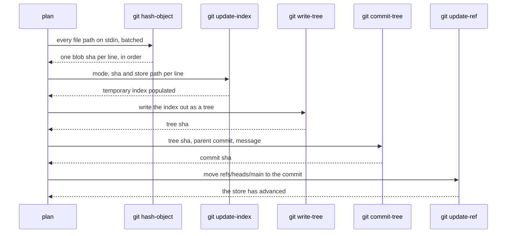
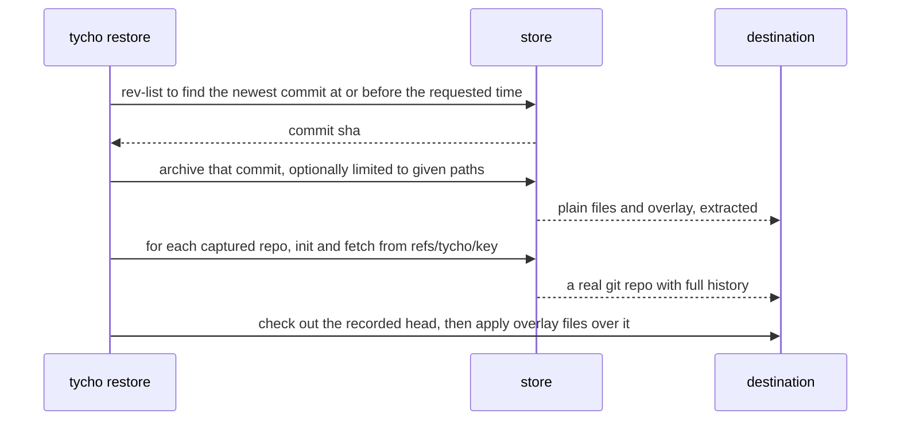

# The store

One bare git repository per profile. It holds every backup ever taken: plain files
as trees on `refs/heads/main`, captured repository history as objects reachable
from `refs/tycho/*`. Nothing about it is Tycho-specific - it is a git repository,
and `git log`, `git show` and `git clone` all work on it directly.

Default location, overridable per profile with `store_path`:

| Platform | Path |
|---|---|
| macOS | `~/Library/Application Support/tycho/store/<profile>.git` |
| Windows | `%LOCALAPPDATA%\tycho\store\<profile>.git` |

## 1. Why bare

The store has no working tree. Files are hashed straight from the source into the
object database, so the local disk cost is the compressed object database and
nothing else - not a second full copy of your data. It also removes checkout as a
failure mode: there is no working tree to be left dirty by an interrupted run.

## 2. Ref layout

```text
refs/heads/main                        the backup history, one commit per run
refs/tycho/<key>/heads/<branch>        a captured repo's branches
refs/tycho/<key>/tags/<tag>            its tags
refs/tycho/<key>/remotes/<remote>/...  its remote-tracking refs
refs/tycho/<key>/stash                 its stash, if any
```

`<key>` identifies a captured repository: the root alias, then the repo's path
relative to that root. `~/Developer/CoreEngineX/org/handbook` under a root
aliased `CoreEngineX` becomes `CoreEngineX/org/handbook`.

Git forbids space, `~`, `^`, `:`, `?`, `*`, `[`, `\`, `..`, and control characters in
ref names, so each path component is percent-encoded on the way in and decoded on
the way out. Common paths pass through unchanged and stay readable in
`git for-each-ref`.

Capturing a repo is one fetch:

```text
git -C <store> fetch --prune <repo-path> "+refs/*:refs/tycho/<key>/*"
```

`refs/*` deliberately includes remote-tracking refs and the stash. The stash is
uncommitted work that exists on exactly one disk, which makes it precisely the
thing a backup is for. `--prune` means a branch you delete locally stops being a
ref here, while its objects stay reachable from older backup commits.

Nothing about this is an archive format. The store's object database is the same
one git would build for those repositories, so a repo whose refs have not moved
since the last run transfers zero bytes and occupies zero additional space.

## 3. Tree layout on `refs/heads/main`

```text
<alias>/<path relative to the root>              plain files, mirrored
<alias>/<repo path>/REPO.txt                     provenance for a captured repo
<alias>/<repo path>/overlay/<path in repo>       what git alone cannot restore
```

A directory that is itself a git repository does not appear here as its tracked
files - those live in the object database, reachable from `refs/tycho/`. What
appears is the overlay and the provenance file, so a reader browsing the tree finds
a marker explaining what that directory is rather than an empty hole.

`REPO.txt` is one screen of plain text:

```text
origin   git@github.com:CoreEngineX/handbook.git
head     main @ 1930b99a
state    clean
refs     14 branches, 3 tags, 1 stash
```

## 4. The commit pipeline

Everything is git plumbing against a temporary index file, in batch. Two processes
handle every file rather than two processes per file.



Concretely:

```text
git -C <store> hash-object -w --stdin-paths < paths
git -C <store> update-index --index-info < "mode sha\tpath" lines
git -C <store> write-tree
git -C <store> commit-tree <tree> -p <parent> -m <message>
git -C <store> update-ref refs/heads/main <commit>
```

`GIT_INDEX_FILE` points at a temporary index built from scratch each run, so a
stale index can never contribute a stale entry. The index is discarded afterwards.

File modes: `100644` for a regular file, `100755` when the owner execute bit is
set, `120000` for a symlink whose blob content is the link target. Symlinks are
stored as links and never followed, which also makes link loops a non-issue.

**Empty directories are not represented.** Git has no tree entry for them. A
watched tree that is empty apart from directory structure restores as nothing,
which is documented rather than worked around - a `.gitkeep` shim would be Tycho
writing into your data.

### Why hash everything, every run

A change-detection cache keyed on size and mtime would skip re-reading unchanged
files. It would also introduce a class of bug where a file whose mtime did not move
is silently never backed up again, and that failure is invisible until a restore.
At a few GB the full read costs seconds. The cache is an optimisation to add after
measuring, behind a flag, not a starting assumption.

## 5. Commit messages

The subject is the timestamp and profile. The body is what a human needs in order
to decide whether this is the commit to restore from.

```text
backup 2026-08-02 12:00 UTC - coreenginex

files: 3 changed, 1 added, 0 deleted across 2 roots
  ~ CoreEngineX/org/handbook/incorporation/README.md
  ~ CoreEngineX/org/website/src/app/page.tsx
  + Books/receipts/2026-07-apple-developer.pdf
repos: 12 captured, 2 advanced
  CoreEngineX/org/handbook   main @ 1930b99  clean
  CoreEngineX/org               main @ aef686f  1 untracked in overlay
totals: 1.21 GB tracked, 38 MB new objects, 41s
```

The file list comes from `git diff-tree --name-status` between the new tree and the
parent commit, truncated to 50 entries followed by "and N more". `tycho history`
renders these; plain `git log` shows the same text.

An empty run - nothing changed anywhere - still commits, with a body reading
`no changes`. A gap in the history would otherwise be ambiguous between "nothing
changed" and "the backup did not run", and that ambiguity is the exact failure mode
this project exists to eliminate.

## 6. Growth and garbage collection

The store keeps full history forever. That is the point: any backup is
recoverable, with no retention policy to get wrong. It has two consequences worth
stating plainly.

**A mistake committed once is permanent.** Point Tycho at a directory of large
binaries, and those objects stay in history even after you fix the config. The
guard is `tycho run --dry-run`, which prints the plan with byte counts before the
first real run, and the default junk ignores. The escape hatch is a fresh store
with the old one archived, which is a deliberate manual act.

**Large frequently-changing binaries grow the store.** Git deltas text well and
binaries poorly. Tycho's target is developer machines and company documents, and
that limit is stated in the README rather than hidden.

`git gc --auto` runs after each successful push. All `refs/tycho/*` refs are
reachability roots, so nothing captured is ever pruned.

## 7. Restore



Plain files are extracted with `git archive`, which streams a tree without needing
a working tree in the store.

A captured repository is restored as a repository, not a copy of files:

```text
git init <dest>/<repo path>
git -C <dest>/<repo path> fetch <store> "+refs/tycho/<key>/heads/*:refs/heads/*"
git -C <dest>/<repo path> checkout <recorded branch or sha>
```

Then the overlay is copied over the checkout, restoring uncommitted edits,
untracked files and gitignored files on top of the recovered history. `REPO.txt`
records which head to check out, including the detached and unborn cases.

`tycho restore --bundle` writes `git bundle create --all` from the restored refs
instead, for handing history to someone without the store.
