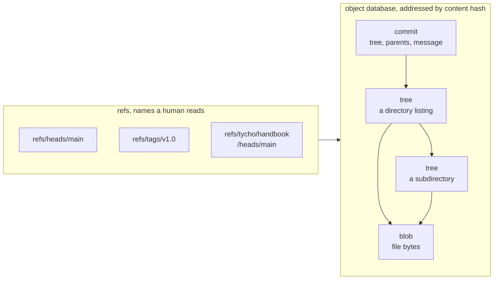

# The git concepts Tycho is built on

Tycho uses git as a storage engine rather than as a version control tool, so it
leans on parts of git that everyday use never exposes. This is those parts, and
only those parts. If you are comfortable with `clone`, `commit` and `push` but have
never had a reason to care what a ref is, start here.

## 1. Git stores two things: objects, and names for objects

### Objects

An object is content, addressed by the hash of its own bytes. Three kinds matter:

| Object | Holds | Does not hold |
|---|---|---|
| **blob** | a file's bytes | its name, its path, its permissions |
| **tree** | a directory listing: names, modes, and the blob or tree each points to | file contents |
| **commit** | one tree, zero or more parent commits, author, date, message | files |

A commit does not contain your files. It points at a tree, which points at blobs
and other trees. Reading a commit means walking that chain.

Because an object's name *is* the hash of its content, **identical content is stored
once**. Two files with the same bytes are one blob. A file unchanged between two
commits is the same blob in both trees, stored once, referenced twice.

This is not an optimisation Tycho implements. It is what an object database is, and
it is the reason capturing a repository's history costs nothing when that history
has not moved.

### Refs

A ref is a name pointing at a commit hash. `refs/heads/main` is a file containing
41 bytes - a hash and a newline. **That file is the branch.** There is no branch
object.

Everything you already use is a ref in some namespace:

| What you call it | What it is |
|---|---|
| branch `main` | `refs/heads/main` |
| tag `v1.0` | `refs/tags/v1.0` |
| `origin/main` | `refs/remotes/origin/main` |
| the stash | `refs/stash` |
| `HEAD` | a ref that points at another ref |

Git does not treat these namespaces specially in storage - only in commands.
`git branch` lists `refs/heads/*` because that is what it was written to list.

**You can create your own namespace and git will not object.**
`refs/tycho/handbook/heads/main` is an ordinary ref. `git branch` in the store
will not show it, because `git branch` only looks under `refs/heads/`. That is
exactly what Tycho wants: captured history should not appear in the store's own
branch list.

## 2. Reachability is why refs matter

`git gc` deletes any object not reachable from a ref. Reachable means: start at
every ref, follow each commit to its parents, follow each tree to its blobs and
subtrees, mark everything touched. Whatever is unmarked is garbage.

So a ref is a **root of reachability**, and that is its real job. Putting captured
repository history under `refs/tycho/*` is not labelling - it is the mechanism that
stops garbage collection from deleting all of it.

The same fact explains a thing that surprises people: deleting a branch does not
free space if any other ref still reaches those commits, and it does not free space
immediately even when nothing does, because the reflog holds a reference until it
expires.

## 3. Refspecs: `source:destination`

Fetch and push both take refspecs, which map ref names on one side to ref names on
the other.

    git push origin main

is shorthand that git expands to:

    git push origin refs/heads/main:refs/heads/main

Take my local `main`, write it to their `main`. Tycho's fetch is the same mechanism
with a different mapping:

    git fetch --no-tags <repo> "+refs/*:refs/tycho/handbook/*"

Take every ref over there and write it here under that prefix instead.
`refs/heads/main` arrives as `refs/tycho/handbook/heads/main`. `refs/tags/v1.0`
arrives as `refs/tycho/handbook/tags/v1.0`.

The leading `+` means force: overwrite the destination even when the change is not
a fast-forward. That is correct for a mirror of somebody else's history and wrong
for your own work, which is why you rarely type it by hand.

**`--all` is a trap for this design.** `git push --all` is defined as
`refs/heads/*` and nothing else. Captured history under `refs/tycho/*` would
silently never leave the machine. Tycho always names both refspecs explicitly.

## 4. Bare repositories

A bare repo has no working tree - the contents of `.git` sit directly in the
directory. Nothing else differs; the object database and refs are identical.

It is what you push *to*, because pushing into a repository with a checked-out
branch would leave that repository's working tree disagreeing with its own HEAD.
Both Tycho's store and every remote are bare.

## 5. Porcelain and plumbing

`git commit` is *porcelain* - a convenience wrapper over the real operations.
Underneath, making a commit is four steps:

| Step | Plumbing command | Produces |
|---|---|---|
| Store file contents | `git hash-object -w` | a blob hash per file |
| Assemble a directory listing | `git update-index` then `git write-tree` | a tree hash |
| Record it as a commit | `git commit-tree` | a commit hash |
| Move the branch | `git update-ref` | the branch now points at it |

Tycho calls those four directly. That is why its store needs no working tree: a
working tree exists so *you* can edit files, and nothing about writing a commit
requires one.

It is also why a run is atomic. The first three steps only add new objects, which
are invisible to anyone until something points at them. The single step that
changes what the store *means* is the last one, and it is one file write.

## 6. Packs and delta compression

Loose objects get combined into packfiles, where git stores similar objects as
deltas against each other. This is why a repository's history is far smaller than
the sum of its versions.

Delta compression works on similar content. Two versions of a source file are
almost identical, so the second costs bytes. Two versions of a compressed archive
are entirely different byte sequences even when their contents barely changed, so
the second costs its full size.

That is the concrete reason `decisions.md` rejects storing git bundles as files: a
bundle is a compressed archive, so every backup would store a complete new copy.
Storing the same history as objects lets git delta it the way it was designed to.

## 7. What this buys Tycho

Every design choice in the architecture docs traces back to something above:

| Choice | The git fact behind it |
|---|---|
| Capture history by fetching refs | Content addressing deduplicates automatically |
| Store captured refs under `refs/tycho/*` | Refs are reachability roots, so nothing is collected |
| Never use `--all` when pushing | `--all` means `refs/heads/*` only |
| A bare store with no working tree | A working tree exists for editing, and nothing here edits |
| Build commits with plumbing | Only `update-ref` changes meaning, so runs are atomic |
| Remotes are bare repos in folders | Pushing to a checked-out repo corrupts its working tree |
