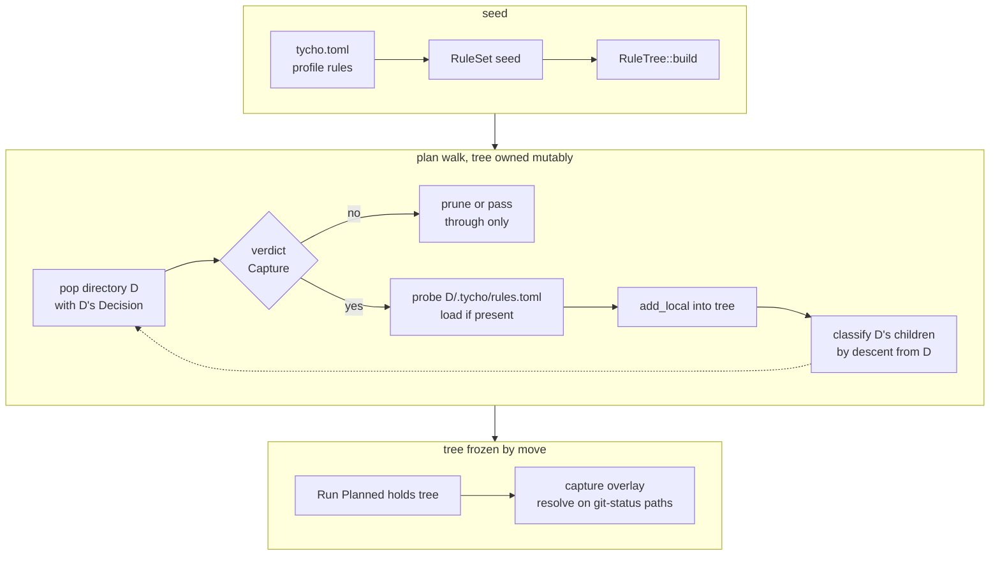
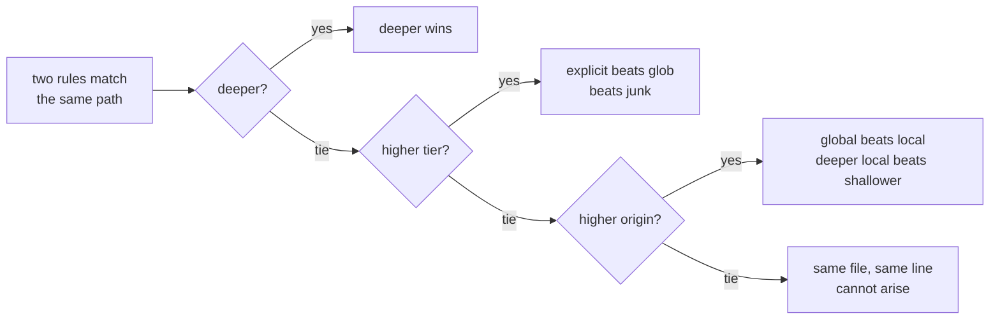
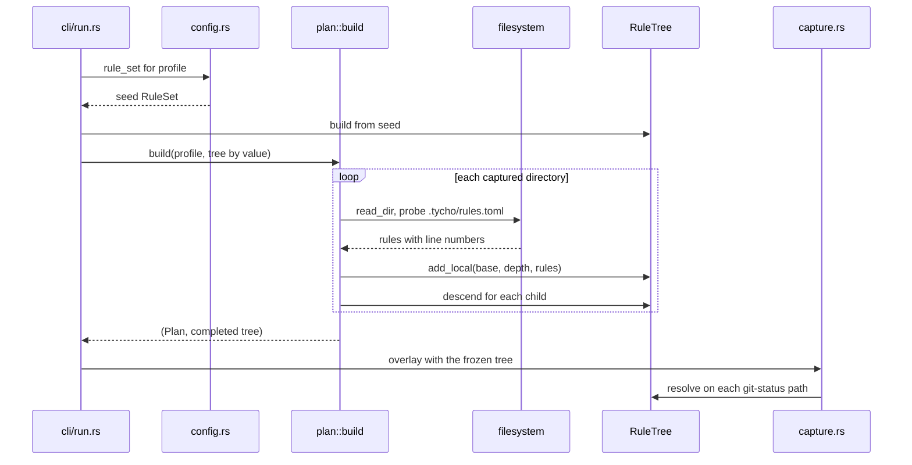

# RFC 001 -- Local rule files

| Field             | Value                                                    |
|-------------------|----------------------------------------------------------|
| **Status**        | `Locked`                                                 |
| **Ticket**        | `ENG-279`                                                |
| **Branch**        | `dev`                                                    |
| **Contract docs** | `docs/architecture/config.md`, `docs/architecture/capture.md`, `docs/architecture/cli.md` |
| **Start date**    | `2026-08-18`                                             |
| **Updated**       | `2026-08-18`                                             |

---

## Summary

Rules today live in one file, `~/.config/tycho/tycho.toml`, and every one of them
is an absolute path pinned to this machine's exact layout. This RFC lets any
directory inside a watch tree carry a `.tycho/rules.toml` whose entries are
relative to that directory, discovered by the plan walk itself - the walk already
visits every reachable directory, so finding rule files costs nothing - and folded
into the same single `RuleTree` the resolver already uses, which grows only while
the plan is being built and is frozen before capture starts. Tycho adopts git's
constraint verbatim - a rule file inside a skipped directory is never read -
because that constraint is the only thing that keeps `may_contain_captures` a
correct basis for pruning, and pruning is what stops the walk from reading 36,819
dataset files.

---

## Why this RFC, why now

Tycho's rule engine resolves a path by walking its components from the filesystem
root, collecting every rule that matches an ancestor, and keeping the deepest
match with ties broken by tier (`Junk < Glob < ExplicitPath`). That algorithm is
specified by the eight-row truth table in `docs/architecture/config.md` section 5
and tested row by row in `src/config/rules.rs`. It is sound and it is not what
this RFC changes.

What this RFC changes is where rules come from. Right now the answer is "one
file, absolute paths only", which has two consequences:

**A rule is pinned to a path, and when the path moves the rule fails silently.**
The live config contains `~/Developer/CoreEngineX/products/photoflick/mllab/datasets`.
Rename `mllab`, move `photoflick`, or run tycho on a second machine with a
different home, and that rule matches nothing. Nothing errors. The next scheduled
run at 03:00 quietly captures 35 GB it was told to skip. `tycho run --dry-run`
reports rules that matched nothing, which is the designed defence, but a scheduled
run is by definition the one nobody is watching.

**A rule cannot live next to the thing it describes.** The rule above is about
`mllab`. It lives four levels above `mllab`, in a file in `~/.config`. Nothing
ties the two together: `mllab` can be moved, forked, or cloned onto another
machine and its backup policy does not travel with it.

This is not urgent and the RFC should not pretend otherwise. Nothing breaks
tonight if we defer. The honest why-now is structural: this is the moment the
rule set is still small enough that changing where rules live is a four-rule
migration instead of a forty-rule one.

**The urgent half is not in this RFC.** Making the global config accept a path
relative to a watch root removes the silent-failure bug above on its own, in a
fraction of the work, with no new file format and no second source of truth. That
change is listed under Out (deferred) and should land first if only one of the
two is ever built. This RFC is the larger half: rules that live with the data.

---

## Scope

### In

- `.tycho/rules.toml`, honoured in **any** directory inside a watch tree whose
  own verdict is Capture, with entries interpreted relative to the directory
  that contains it.
- A containment invariant: a local rule may only name paths at or below its own
  directory. Absolute paths, `~`, `$`, drive letters, `\` separators, `..`
  components, and empty or `.` entries are rejected at parse time with the file
  and line.
- Discovery performed by the plan walk itself (`plan::walk_root`): a directory's
  `.tycho/rules.toml` is loaded when the walk pops that directory, before its
  children are classified. No separate pass, no extra traversal.
- The tree grows only during planning: `plan::build` owns the `RuleTree`
  mutably and returns it; the run pipeline then holds it immutably, and the
  existing `spine!` ordering guarantees capture never sees a partial tree.
- `Origin` as a third sort key in `Decision`, below `depth` and `tier`, so a
  global rule and a local rule naming the identical path at the identical tier
  resolve deterministically.
- Local globs, anchored to the declaring directory's subtree.
- Provenance as types: `Decision` carries a `Copy` rule id into an arena of
  `RuleMeta { text, source }` instead of a cloned `String` (audit F6), and the
  walk resolves children by descending from the parent's decision instead of
  re-deriving every ancestor per path (audit F4).
- The re-inclusion constraint: a `.tycho/rules.toml` inside a directory the
  resolver skips is never read - including a skipped directory the walk
  descends through only to reach a deeper re-include - documented and tested.
- Nested watch roots within one profile remain the existing hard error
  (`NestedWatchedRoot`); cross-profile overlap becomes a warning with a Y/N
  confirmation at `tycho watch` time.
- `tycho rules explain <path>`: prints the winning rule and every beaten
  candidate, each with verdict, depth, tier, origin, and the file and line that
  declared it.
- `--local` on `tycho ignore` and `tycho reinclude`, always explicit, writing to
  the `.tycho/rules.toml` of the deepest capture-verdict ancestor of the target
  and creating it if absent.
- Reporting: every local file read, with its rule count, listed by `run`,
  `run --dry-run`, and the check path; local rules that matched nothing reported
  with file and line.
- Fixes riding along: delete the dead `RedundantWatch` diagnostic (audit F3);
  deduplicate `record_hits` (audit F5).
- Docs: `config.md` section 5 gains the origin tiebreak and the reachability
  constraint; `capture.md` gains discovery in the run sequence; `cli.md` gains
  the `rules` command and the `--local` flags.

### Out (deferred)

- **Relative paths in the global config.** Independently shippable, removes the
  silent-failure bug on its own, and needs its own answer to "relative to which
  watch root when a profile has several". Recommended predecessor to this RFC,
  not part of it.
- **A gitignore-syntax `.tycho/ignore` file.** Rejected on semantics, not effort;
  see Alternatives D.
- **A no-inherit flag** (rsync's `n` modifier, EditorConfig's `root = true`).
  Speculative until someone has a subtree whose inherited rules are actually
  wrong.
- **`CACHEDIR.TAG` and `--exclude-if-present` sentinels.** Measured against the
  live tree: the only `CACHEDIR.TAG` under the watch root is in
  `photoflick/.ruff_cache/`, and `.ruff_cache` is already a junk name. Zero value
  today.
- **Anything in `.tycho/` other than rules.** No per-directory remotes, schedules,
  or retention. The directory shape exists so those are addable later without a
  format break; adding them now is scope creep.
- **Adopting the `ignore` crate's walker.** See Alternatives C.

---

## Guide-level explanation

Today the mllab dataset exclusion is written in `~/.config/tycho/tycho.toml` as an
absolute path:

```toml
ignore = [
  "~/Developer/CoreEngineX/products/photoflick/mllab/datasets",
]
```

After this RFC it can instead live in `mllab` itself, at
`products/photoflick/mllab/.tycho/rules.toml`:

```toml
version = 1

ignore = ["datasets", "out"]
reinclude = ["out/labels.sqlite", "out/labels.sqlite-wal"]
```

Every path is relative to the directory holding the `.tycho`, so the rules survive
`mllab` being renamed, moved, or cloned to another machine. The global config
shrinks to what is genuinely machine-scoped:

```toml
[[profile]]
name = "cex"
watch = ["~/Developer/CoreEngineX"]
schedule = { daily = { at = "03:00" } }
local_only = true
```

Writing one from the CLI takes an explicit `--local`, which targets the
`.tycho/rules.toml` of the deepest still-captured ancestor of the path - for an
ignore that is simply the parent, and for a re-include under an ignored directory
it is the nearest ancestor above the ignore, which is the only place the rule
would ever be read:

```
$ tycho ignore --local ~/Developer/CoreEngineX/products/photoflick/mllab/datasets
added   datasets
        in products/photoflick/mllab/.tycho/rules.toml
```

Asking why a path is or is not backed up names the file that decided it:

```
$ tycho rules explain ~/Developer/CoreEngineX/products/photoflick/mllab/out/labels.sqlite
capture  out/labels.sqlite
         products/photoflick/mllab/.tycho/rules.toml:5
         depth 11, tier explicit-path, origin local
beaten:  ignore  out
         products/photoflick/mllab/.tycho/rules.toml:4
         depth 10, tier explicit-path, origin local
```

And a run says what it read:

```
$ tycho run cex --dry-run
rules    4 global, 7 local from 3 files
         products/photoflick/mllab/.tycho/rules.toml        4 rules
         products/spass/spass-core/.tycho/rules.toml        2 rules
         handbook/.tycho/rules.toml                         1 rule
```

The one rule to learn: **a local file only has authority over its own subtree, and
it is only read if its own directory is captured.** If a directory is skipped,
tycho does not descend into it, so a `.tycho` inside it is never seen - and even
when tycho passes through a skipped directory to reach something deeper that was
re-included, it still does not read that directory's `.tycho`. To carve something
out of an ignored directory, put both the ignore and the carve-out in a file at or
above the directory doing the ignoring - which is where you would naturally write
them anyway.

---

## Reference-level explanation

### Discovery rides the walk



There is no discovery pass. `walk_root` already reads every reachable
directory's listing; on popping a directory whose own verdict is Capture, it
probes for `.tycho/rules.toml` (one `stat`), loads it if present, and only then
classifies the children. A pruned directory is never `read_dir`'d, so a `.tycho`
inside one is physically never opened - the re-inclusion constraint is enforced
by the absence of code rather than by a check.

### Why in-walk discovery is correct

The containment invariant does the work: **a local rule may only name paths at
or below its own directory**, so any rule that can affect a path was declared in
that path's ancestor chain - and every descent, stack-based or otherwise, visits
ancestors before descendants. The rules a child needs are always already loaded
when the child is classified.

Two details close the loop:

- **A directory's own decision is computed before its `.tycho` loads**, and
  containment forbids a local file naming its own directory (empty and `.`
  entries are parse errors). A `.tycho` can therefore never flip the verdict of
  the directory that admitted it.
- **The tree is complete when the walk ends**, because every capture-verdict
  directory was visited and probed. Capture - which resolves paths parsed out of
  `git status` output, with no walk context - therefore sees every rule.

Ownership encodes the freeze: `plan::build` takes the `RuleTree` by value,
mutates it during the walk, and returns it; the pipeline then holds it
immutably, and `Captured` is only reachable from `Planned` through the sealed
`spine!` ordering. Handing capture a partial tree is not a bug to test for; it
does not compile.

### Types

```rust
/// Where a rule came from, and how much authority that gives it when two rules
/// name the same path at the same tier and depth. Ordered: junk loses to a local
/// file, a deeper local file beats a shallower one, and the operator's own config
/// beats every local file, so a repository's rules can always be overridden
/// without editing the repository.
#[derive(Clone, Copy, Debug, PartialEq, Eq, PartialOrd, Ord)]
pub enum Origin {
    Junk,
    /// Depth of the directory holding the `.tycho` that declared the rule.
    Local(usize),
    Global,
}

/// One rule's identity in the tree's arena. `Copy`, so a `Decision` costs nothing
/// to carry down the walk stack.
#[derive(Clone, Copy, Debug, PartialEq, Eq)]
pub struct RuleId(u32);

/// What a rule id resolves to when a human needs to read it.
#[derive(Clone, Debug, PartialEq, Eq)]
pub struct RuleMeta {
    /// As written in its file, not as expanded.
    pub text: String,
    pub source: Source,
}

/// The file a rule was written in. A `Local` carries the line so `rules explain`
/// can name it; `Junk` is compiled in and has no file.
#[derive(Clone, Debug, PartialEq, Eq)]
pub enum Source {
    Junk,
    Global,
    Local { file: AbsPath, line: u32 },
}

#[derive(Clone, Copy, Debug, PartialEq, Eq)]
pub struct Decision {
    pub verdict: Verdict,
    pub tier: Tier,
    pub depth: usize,
    pub origin: Origin,
    /// `None` when no rule matched anywhere - genuine absence, not a sentinel.
    pub rule: Option<RuleId>,
}
```

`Decision.rule` changes from `String` to `Option<RuleId>`. The string was
smuggling provenance through prose - with one config file the rule text was
enough to identify it, with several it is not - and it cost a clone per matched
component in the hottest loop in the program. Text is rendered from the arena
only when a person asks.

`Origin` is a separate field from `Source` deliberately: `Origin` participates in
ordering and is `Copy`, `Source` is display data and is not. Folding a path into
the ordering key would make two sibling local files compare by path bytes, which
is deterministic but meaningless.

### Resolution by descent

`resolve()` re-derived every ancestor's decision for every path: a file at depth
14 recomputed 13 decisions the walk already made visiting its parents. The walk
now carries each directory's `Decision` on its stack and classifies children with

```rust
fn descend(&self, parent: Decision, child: &Path) -> Decision
```

which evaluates only the rules matching the child itself - one explicit-map
lookup, one junk-name check, one glob match against a single candidate. Any
child-depth match beats the inherited parent best by depth; ties break by tier
then origin; no match inherits the parent. `resolve()` remains the fold of
`descend` over a path's components, so there is one implementation and the
overlay - whose paths come from `git status` stdout and carry no walk context -
keeps calling it unchanged.

`record_hits` gets the same shape: per child it matches one candidate instead of
every prefix, with a single full-chain record for the watch root's own ancestors
at walk start.

### Precedence



`consider` compares `(depth, tier, origin)`. The existing eight truth-table rows
are untouched: `origin` is only consulted when depth and tier both tie, which
with one config file never happened.

### Rule file format

```toml
version = 1

ignore    = ["datasets", "out"]
reinclude = ["out/labels.sqlite"]
globs     = ["*.tmp"]
```

Same key names as the profile's rule keys, so there is one vocabulary. `watch` is
not accepted: a local file scopes what happens inside a watch, it cannot create
one. `version` is required, matching the global config. A glob is anchored to the
declaring directory's subtree: `*.tmp` in `mllab/.tycho` matches under `mllab`
and nowhere else, with the base path glob-escaped so a directory named `foo[1]`
cannot corrupt the pattern.

Unknown keys are a **warning** naming the file, surfaced in the run summary, and
an **error** under the check path. The asymmetry is deliberate: a `.tycho`
authored against a newer tycho must not break tonight's backup, but a typo
(`ignor = [...]`) must be loud somewhere, and the check is where people go
looking for typos.

### Invariants

- **Containment.** A local rule names only paths at or below the directory
  containing its file. Absolute paths, `~`, `$`, drive letters, `\`, `..`, and
  empty or `.` entries are rejected at parse time with the file and line. This
  is what makes in-walk discovery correct, and it means a cloned repository's
  rules cannot reach outside the repository.
- **Reachability.** A `.tycho/rules.toml` is read only if the directory
  containing it resolves to Capture. A skipped directory's file has no effect -
  even when the walk passes through that directory to reach a deeper explicit
  re-include.
- **One tree per run, frozen before capture.** The tree is mutable only inside
  `plan::build`, which owns it; everything after planning holds it immutably.
  Enforced by ownership and the `spine!` ordering, not by convention.
- **Symlinks are not followed.** Discovery descends only into
  `FileKind::Directory`, which `classify_path` assigns from `symlink_metadata`,
  so a symlinked directory is never entered and a `.tycho` behind one is never
  read. Inherited from the existing walk, not added here.
- **`.tycho/` is captured.** The rule files are backed up like any other file,
  so a restore brings the rules back with the data.

### What does not change

| Surface | Change |
|---|---|
| `RuleTree::captures` | none |
| `RuleTree::may_contain_captures` | none |
| the eight truth-table rows | none |
| `capture.rs` (3 call sites) | none - still full `resolve` |
| `config/check.rs` pure validation | none to the build call |

### Interaction diagram



The last two lines are the load-bearing detail. `capture.rs` calls the tree on
paths parsed out of `git status --porcelain` output, which never came from a
tycho directory descent. That is why the tree must be complete and context-free
before capture starts, and it is what rules out the lazy contextual matcher in
Alternatives B.

### Nested and overlapping watch roots

Within one profile, a watch root inside another remains the existing hard error
(`NestedWatchedRoot`, `src/config/check.rs`): a nested root has no answer for
which alias its content is stored under, so it is an error rather than a
resolution rule. This RFC adds nothing there - the check predates it.

Across profiles, overlap is legitimate (different schedules, different remotes,
genuinely separate stores) but worth a pause. `tycho watch add` warns and asks:

```
warning: ~/Developer/CoreEngineX/products is inside ~/Developer/CoreEngineX,
         watched by profile 'cex'
         both profiles will capture it, each into its own store
add it anyway? [y/N]
```

`N` aborts with nothing written. When stdin is not a terminal the warning prints
and the add proceeds, because cross-profile overlap is double coverage, not an
error.

---

## Migration and rollout

- **Persisted data:** none. Rules are inputs, not state. `.tycho` files are new
  files that did not exist before; a tree with none of them resolves exactly as
  it does today.
- **Live behaviour:** additive. An existing config with no local files anywhere
  produces an identical plan, which is the first verification item.
- **Store:** unaffected. This changes which paths are captured, not how they are
  stored, so no repack, no rebuild, no ref surgery.
- **Rollback:** delete the `.tycho` directories, or run the previous binary,
  which ignores them as ordinary files. Nothing is one-way.
- **`RedundantWatch` (audit F3) is deleted without a deprecation step:** it was
  unreachable (the same condition errors first in the same function), so no
  config that parses today can observe its absence.

---

## Edge cases

| Case | Behaviour |
|------|-----------|
| `.tycho/rules.toml` with an absolute path, `~`, `$`, a drive letter, or `\` | Parse error naming file and line; the run aborts before capture |
| `.tycho/rules.toml` with `..`, an empty entry, or `.` | Same. Containment is enforced, not warned about |
| `.tycho` inside a directory that is ignored | Never read. The documented constraint, with a test asserting the file's rules had no effect |
| `.tycho` inside an ignored directory the walk descends through for a deeper re-include | Still never read: the read condition is the directory's own Capture verdict, not "was descended into". Closes the hole where a repository re-includes a subtree the operator ignored |
| `.tycho` at a watch root | Ordinary case, depth equals the root's depth |
| `.tycho` present but `rules.toml` absent | Silently fine. The directory shape is for future contents |
| `.tycho/rules.toml` unreadable (permissions) | Warning naming the file; the run continues with the rules it could read |
| `.tycho/rules.toml` malformed TOML | Error, run aborts. A rules file that cannot be parsed cannot be assumed permissive |
| Unknown key in a local file | Warning in the run summary; error under the check path |
| `watch` key in a local file | Error. A local file cannot create a watch root |
| Two `.tycho` files, parent ignores `sub`, child re-includes `sub/keep` | `keep` is lost. This is the git constraint. `rules explain` says the child file was never read |
| Global and local both name the same absolute path, opposite verdicts | Global wins by `Origin`. `rules explain` prints both, winner first |
| Two local files at different depths name the same absolute path | Deeper file wins by `Origin::Local(depth)` |
| A symlinked directory containing `.tycho` | Never entered, never read. Inherited from `classify_path` |
| `.tycho` reached through a nested git repository | Read normally. Repository boundaries do not gate rule discovery, only capture strategy |
| A local rule matches nothing | Reported by `--dry-run` alongside global unfired rules, with its file and line |
| `tycho ignore --local X` where X's parent is captured | Rule lands in the parent's `.tycho/rules.toml`, created if absent |
| `tycho reinclude --local X` where X sits under an ignored directory | Rule lands in the `.tycho` of the deepest capture-verdict ancestor - above the ignore, the only place it would ever be read |
| `--local` on `tycho watch` | Rejected: a local file cannot create a watch root |
| `.tycho` name case (`.TYCHO`) on a case-insensitive volume | Only the exact name `.tycho` is honoured. `classify_path` reports what the filesystem returns; a name that differs in case is an ordinary directory |
| A directory named `foo[1]` declares a local glob | The base is glob-escaped when the anchored pattern is built, so the bracket is literal |

---

## Privacy, security, and cost notes

- **Security -- a new trust boundary, and this is the real one.** A directory
  inside a watch tree can now change what tycho backs up. Clone a repository that
  ships a `.tycho`, drop it under a watch, and its author has silently altered
  your backup coverage. This is the same trust grant `.gitignore`, `.editorconfig`
  and a Cargo build script already have, but with a worse failure mode: a bad build
  is noticed immediately, a missing backup is noticed when you need the backup.

  Four things bound it. The containment invariant means a local file can only
  affect its own subtree - it cannot reach your home directory or another
  project. The capture-verdict read condition means a subtree you ignored cannot
  carry a file that re-includes itself. `Origin::Global` beating every local file
  means the operator always has an override that does not require editing someone
  else's repository. And every file read is named in the run summary, so a
  `.tycho` appearing after a `git pull` is visible rather than silent.

  The mitigation is deliberately reporting, not restriction. Restricting local
  files to ignore-only would let a hostile file reduce coverage, which is the
  attack; restricting them to re-include-only would make them useless for the
  motivating case.

- **Privacy:** none. No new data leaves the machine.

- **Cost:** one `stat` per captured directory (the `.tycho/rules.toml` probe) -
  a few thousand calls against a walk that hashes tens of thousands of files -
  and strictly less work per path than before, since descent replaces per-path
  ancestor re-derivation and per-prefix glob matching.

---

## Drawbacks

- **Tycho starts writing into the tree it backs up.** Today it reads your files
  and writes only to its own store. That is a genuinely valuable property to
  spend, and `--local` spends it.
- **`.tycho` inside a git repository is untracked.** Commit it and personal backup
  preferences ship to collaborators who do not use tycho; gitignore it and it does
  not survive a fresh clone, which was half the point. There is no answer here that
  is right for every repository, and the RFC does not invent one - it leaves the
  choice to whoever owns the repository.
- **Two sources of truth.** "Why is X not backed up" becomes a question with more
  than one place to look. `rules explain` is the mitigation and it is in scope for
  exactly that reason, but a command you have to know about is weaker than a single
  file you can read.
- **The re-inclusion constraint will confuse someone.** Git has shipped this exact
  footgun for two decades and it still generates blog posts. Tycho inherits both
  the constraint and the confusion.
- **`config_edit.rs` grows.** It is already the largest file in the project and it
  gains a second write target.
- **The rule set stops being knowable from one file.** Part of the profile now
  lives on the filesystem, so validating it fully means walking.

---

## Alternatives considered

### A. Root-anchored only -- one `.tycho` at each watch root

The original proposal: `tycho watch A` creates `A/.tycho`, and that one file
covers A's whole subtree. Simplest possible version, and it keeps discovery
trivial since all rule files are known before any walk.

**Rejected because it does not deliver the goal.** Watch roots are broad;
projects are deep. The watch root here is `~/Developer/CoreEngineX` and the rule
is about `products/photoflick/mllab`. Under this design the rule lives four levels
above the directory it describes, still breaks when `mllab` moves, and still does
not travel with `mllab`. It is the global config with a new location, not rules
that live with the data.

### B. Lazy contextual matcher -- ripgrep's shape

Thread a persistent hierarchical matcher through the walk: each directory's
matcher points at its parent's, rules are read as the walk reaches them, no
complete tree ever exists. This is what the `ignore` crate does and it is proven
at ripgrep's scale.

**Rejected on hard evidence.** `capture.rs` calls `rules.captures(path)` on
paths parsed out of `git status --porcelain=v1 --ignored` output. Those paths
never came from a tycho directory descent, so there is no matcher stack to consult
- the lazy design would have to reconstruct one by walking down from the watch
root for every overlay path. Ripgrep never needs to answer "is this path filtered"
outside its own walk; tycho does, in the code path that handles gitignored files,
which is the code path this feature exists for.

### C. Adopt the `ignore` crate wholesale

`ignore` (BurntSushi, same author as the `globset` tycho already depends on)
implements hierarchical per-directory ignore files with
`WalkBuilder::add_custom_ignore_filename`, including the parallel walk.

**Rejected on semantics.** `ignore` implements gitignore resolution: last match
within a file wins, files ordered by a fixed precedence list. Tycho implements
deepest match wins with a tier tiebreak, specified by a truth table and tested row
by row. Adopting `ignore` means adopting gitignore's resolution rule, silently
changing what eight documented rows mean. Beyond that: `ignore` is a walker, and
tycho's walk also does repository detection, nested-repository handling, and
overlay construction, so it is not a component tycho can hand its walk to.

### D. gitignore syntax in a `.tycho/ignore` file

Familiar to everyone, no new format to learn.

**Rejected because familiar syntax with unfamiliar semantics is worse than an
unfamiliar format.** A reader who sees gitignore syntax will assume gitignore's
last-match-wins resolution and negation behaviour. Tycho resolves by depth and
tier. TOML with the same key names as the profile keys signals "this is tycho
rules, scoped" rather than "this is a gitignore", and reuses a parser and a
vocabulary that already exist.

### E. Sentinel files only -- `CACHEDIR.TAG` and `.nobackup`

The zero-config version borg and restic both support: a marker file in a directory
means skip this subtree, with no rule language at all.

**Rejected on measurement, and partly adopted in spirit.** Checked against the
live watch tree: the only `CACHEDIR.TAG` present is in
`photoflick/.ruff_cache/`, and `.ruff_cache` is already a compiled-in junk name.
Honouring the standard today would change nothing. It also cannot express the
motivating case, which is ignoring `out` while keeping `out/labels.sqlite`. Worth
revisiting as a cheap compatibility win once local files exist, listed under
Future possibilities.

### F. Relative paths in the global config, and nothing else

Accept `products/photoflick/mllab/datasets` in the profile's `ignore` list,
resolved against the watch root it falls under.

**Not rejected -- promoted.** This removes the silent-failure bug, needs no new
file format, does not write into the watched tree, and introduces no second source
of truth. It is listed under Out (deferred) as the recommended predecessor rather
than folded in, because it is independently shippable and has its own open
question (which watch root, when a profile has several). If only one of the two
changes is ever built, it should be this one.

### G. A level-order discovery pre-pass -- this RFC's own first design

Walk directories only, breadth-first by depth, collecting `.tycho` files and
rebuilding the tree per level; then run the real walk against the finished tree.
This was the Reference-level design in the first draft of this RFC.

**Superseded during review.** The plan walk already visits every reachable
directory, so a separate discovery traversal reads 4,592 directory listings that
are about to be read again - a redundant scan justified only by the fear that
mid-walk mutation would be unsafe. The containment invariant dissolves the fear:
rules affecting a path come only from its ancestors, and any descent visits
ancestors first, so BFS ceremony adds nothing DFS does not already guarantee.
(An earlier sketch of the pre-pass as a fixpoint loop was worse still: a
parent's rules can retract a child rule file already read, so the loop is
non-monotone and has no termination argument. Recorded so nobody re-derives it.)

---

## Prior art and related work

**What our platform says.** Tycho is built on git and its resolver deliberately
diverges from gitignore's, so git is the first place to look and it answers the
central question outright. gitignore(5): *"It is not possible to re-include a file
if a parent directory of that file is excluded. Git doesn't list excluded
directories for performance reasons, so any patterns on contained files have no
effect, no matter where they are defined."* That is exactly tycho's
`may_contain_captures` constraint, hit by the same tool for the same reason, and
git's resolution is a stated invariant rather than machinery. This RFC adopts it
verbatim. Note what git does **not** guarantee: it has no notion of a re-include
surviving an excluded parent under any flag, so there is no vendor-blessed escape
hatch to inherit.

**How adjacent tools draw the same line.** rsync's `dir-merge` filter rule is the
closest existing design to this proposal, and it is more specified than git's. Per
the manual: *"dir-merge rules are evaluated as rsync progresses through the file
list, searching each directory encountered for the file named in the rule's
pattern"* - discovery riding the transfer's own traversal, which is precisely the
shape this RFC lands on - and *"as we find dir-merged files in the transfer, their
rules are prepended to their dir-merge chain so that a deeper directory's rules
take precedence over its parent's rules."* Deeper-wins is rsync's answer and it is
already tycho's resolution rule, which is the strongest argument that hierarchical
rule files fit this engine rather than fighting it. rsync also ships two modifiers
worth naming: `n` (rules are not inherited by subdirectories) and `e` (exclude the
merge file's own name from the transfer). This RFC takes neither - `n` is
deferred as speculative, and `e` is actively rejected: borg backs up its
`.nobackup` marker precisely so the marker survives a restore, and the same
reasoning applies here.

EditorConfig solves the mirror-image problem - searching *upward* from a file
rather than downward through a traversal - and lands on the same precedence rule:
*"the rules from the closer EditorConfig file are read last, so properties in
closer files take precedence"*, with `root = true` to stop the upward search. The
agreement between a downward traversal (rsync, git) and an upward search
(EditorConfig) on closest-wins is the cross-check that deepest-wins is the
consensus and not one tool's phrasing.

restic and borg both implement the degenerate case, `--exclude-if-present
.nobackup` plus the `CACHEDIR.TAG` convention shared with GNU tar. These are
sentinels, not rule files: they express "skip this subtree" and nothing else, so
they cannot express the carve-out that motivates this RFC. Cargo writes
`CACHEDIR.TAG` into `target/` for exactly this reason.

**The general problem is per-directory rule inheritance under a pruned
traversal.** The literature's answer is that the pruning constraint dominates:
you can have lazy per-directory rule discovery, or you can have re-inclusion into
pruned subtrees, but not both without abandoning pruning. Every tool above chose
pruning. The Rust implementation of the lazy branch is the `ignore` crate, whose
`Ignore` type is *"a persistent hierarchical data structure where each directory
has its own matcher that points to its parent's matcher"*, with *"more nested
ignore files [having] a higher precedence than less nested ignore files"* -
again deepest-wins.

**What this RFC adopts:** git's re-inclusion constraint as a stated invariant,
rsync's discovery-during-traversal and deeper-wins precedence (already tycho's),
borg's back-up-the-marker behaviour, and `ignore`'s hierarchical structure with
the laziness removed. **What it deliberately does not:** `ignore`'s gitignore
resolution semantics and its walker, because tycho's resolver has a different
documented rule and its walk does more than filter; rsync's `n` and `e`
modifiers, as speculative and wrong respectively; and the sentinel-file
conventions, which are measured to be worth nothing on this tree today.

---

## Future possibilities

- **Honouring `CACHEDIR.TAG` and `--exclude-if-present`-style sentinels** becomes
  nearly free: one more thing to notice per directory during a walk that already
  probes every captured directory.
- **`.tycho/` as a home for more than rules.** The directory shape is chosen so
  per-directory retention, a per-directory remote, or a "this subtree is
  sensitive, never push it off-machine" marker can be added without a format
  break.
- **A no-inherit flag** (rsync's `n`, EditorConfig's `root = true`) is a one-key
  addition to a format that already exists, if a subtree ever turns up whose
  inherited rules are actually wrong.
- **`tycho rules explain` generalises past this RFC.** Once a decision can name
  its source, `doctor` can report "this rule has not fired in the last N runs",
  which is the drifted-rule detector the current unfired-rule report only
  approximates.

---

## Decisions (resolved)

### D1. Hierarchical, not root-anchored

The proposal as first stated contained both, and they are opposite designs.
**Chosen:** hierarchical, any captured directory (who: both, in discussion).
Root-anchored is simpler and safer but does not deliver rules that live with the
project, because watch roots sit far above projects - see Alternatives A.

### D2. Git's re-inclusion constraint is adopted rather than engineered around

**Chosen:** a `.tycho` inside a skipped directory is never read (who: author,
from git's documented behaviour). The alternative is descending into ignored
subtrees to look for rule files, which destroys the pruning that
`may_contain_captures` exists to enable. Git made this call for the same reason
and states it as a limitation rather than fixing it.

### D3. Discovery rides the plan walk; no pre-pass

**Chosen:** `walk_root` probes each captured directory for `.tycho/rules.toml`
as it pops it, before classifying children (who: author, via the architecture
audit; supersedes both earlier designs). The fixpoint loop was non-monotone and
had no termination argument; the level-order pre-pass that replaced it was
correct but redundant - it traversed every directory the plan walk was about to
traverse again. Containment makes the in-walk form correct: ancestors are always
visited first, so the rules a child needs are always loaded. See Alternatives G.

### D4. Containment: a local rule may only name paths at or below its own directory

**Chosen:** absolute paths, `~`, `$`, drive letters, `\`, `..`, and empty or `.`
entries are parse errors (who: author). Three payoffs. It makes D3 correct. It
bounds the trust grant: a cloned repository's rules cannot reach outside the
repository. And it keeps a `.tycho` from naming its own directory, so a file can
never flip the verdict of the directory that admitted it.

### D5. Global rules beat local rules on an exact tie

**Chosen:** `Origin::Global > Origin::Local(_) > Origin::Junk`, consulted only
when depth and tier both tie (who: author). **Rejected:** local-wins, on the
argument that a local file is closer to the data. The deciding case is the trust
boundary - if a repository's `.tycho` wins outright, there is no way to override
it without editing a repository you may not own. Ties are rare by construction,
since local rules are usually deeper than global ones and depth is checked first.

### D6. TOML with the profile's key names, not gitignore syntax

**Chosen:** TOML (who: author). Familiar syntax carrying unfamiliar semantics
misleads - see Alternatives D.

### D7. `.tycho/` is captured, not excluded

**Chosen:** rule files are backed up like any other file (who: author, following
borg). A restore that brings back the data but not the rules governing it is a
restore that behaves differently from the machine it came from. rsync's `e`
modifier does the opposite and is rejected for this reason.

### D8. Nested watch roots in one profile: keep the existing error; do not analyse

**Chosen:** the pre-existing `NestedWatchedRoot` hard error stands unchanged
(who: both; the audit found the check already shipped, with a better
justification than this RFC's draft had - a nested root has no answer for which
alias its content is stored under). The "analyse whether the outer root already
ignores the inner one" option is rejected because it makes config validity a
function of config content elsewhere - and the audit found exactly that design
already in the codebase as the dead, wrong `RedundantWatch` warning, which this
RFC deletes as evidence.

### D9. Local files may declare globs, anchored to their subtree

**Chosen:** allowed, anchored (who: user). A local glob matches only under the
declaring directory; the base is glob-escaped when the pattern is built.
**Rejected:** paths-only local files - smaller surface, but the anchored form is
what makes a project's `*.ckpt`-style rule travel with the project.

### D10. `--local` is always explicit

**Chosen:** an explicit flag on `tycho ignore` / `tycho reinclude`, never
inferred (who: user). **Rejected:** implicit-when-a-`.tycho`-exists - less
typing, but the destination of a write would depend on the filesystem's current
state.

### D11. Cross-profile watch overlap warns and asks

**Chosen:** at `tycho watch add`, overlap with another profile's root prints a
warning and a Y/N prompt; N aborts with nothing written; a non-interactive add
warns and proceeds (who: user). Overlap across profiles is legitimate double
coverage - different schedules, different remotes, separate stores - so it is a
pause, not an error.

### D12. The read condition is the directory's own Capture verdict

**Chosen:** a `.tycho` is read only when its directory resolves to Capture -
not merely when the walk descends into it (who: author, via the audit). The walk
does descend into skipped directories that contain a deeper explicit re-include;
reading rule files there would let an ignored subtree re-include itself, which
is the resurrection attack D5 exists to prevent, arriving through a side door.

### D13. `--local` writes to the deepest capture-verdict ancestor

**Chosen:** the target path's deepest still-captured ancestor gets (or already
has) the `.tycho/rules.toml`, and the entry is written relative to it (who:
author). For an ignore this is simply the parent. For a re-include under an
ignored directory it is the nearest ancestor above the ignore - the only
placement at which the rule would ever be read, so any other choice writes a
file that silently does nothing.

---

## Open questions

(none - all resolved into Decisions above.)

---

## Files that will change

| File | Change | Note |
|---|---|---|
| `src/config/rules.rs` | edit | `Origin`, `RuleId`, `RuleMeta`, `Source`; `Decision` becomes `Copy` with `origin` and `Option<RuleId>`; `descend`; `add_local`; anchored per-file glob sets |
| `src/config/local.rs` | **NEW** | parse `.tycho/rules.toml`: spanned entries for line numbers, containment enforcement, unknown-key collection |
| `src/config.rs` | edit | none to `rule_set` semantics; seed only |
| `src/config/check.rs` | edit | delete `RedundantWatch` (F3): loop, variant, `Display` arm |
| `src/plan.rs` | edit | in-walk discovery; stack carries `Decision`; `record_hits` dedupe (F5) and single-candidate form; `Plan.rule_files`; `unfired` reports local rules with file and line; `PlanError::LocalRuleFile`; `Warning::LocalRules` |
| `src/store/run.rs` | edit | `plan::build` takes the tree by value and returns it; both call sites |
| `src/config_edit.rs` | edit | flat-file editor for `.tycho/rules.toml` reusing the atomic-write and decoration mechanics |
| `src/cli.rs` | edit | `Command::Rules` + `RulesArgs`/`RulesAction::Explain`; `--local` on `RuleAction::Add`/`Rm`; `NAMES` grows to 17 |
| `src/cli/rules.rs` | edit | `explain` dispatch; `--local` write path; cross-profile overlap prompt |
| `src/cli/report.rs` | edit | render a rule with its source file and line (first consumer of `at_file_line`) |
| `src/cli/run.rs` | edit | run summary lists local files read with rule counts |
| `src/cli/render.rs` | edit | `rules N global, M local from K files` block in `dry_run` |
| `docs/architecture/config.md` | edit | origin tiebreak + reachability constraint rows; local rule files section |
| `docs/architecture/capture.md` | edit | discovery in the run sequence |
| `docs/architecture/cli.md` | edit | the `rules` command, `--local`, the overlap prompt |
| `docs/decisions.md` | edit | D1-D13 condensed into the project decision record |
| `README.md` | edit | local rule files in the configuration section |
| `src/config/rules.rs` tests | edit | origin tiebreak rows; anchored-glob containment; descent/resolve equivalence |
| `src/config/local.rs` tests | **NEW** | containment rejections with file and line; unknown-key warning; `watch` and `version` handling |
| `tests/plan.rs` | edit | fixture tests: rules fire from a `.tycho`; ignored dir's file has no effect; carve-out-transit dir's file not read; unreadable file warns |

---

## Verification checklist

### Automated

- [ ] `TYCHO_CROSS=1 ./scripts/ci-check.sh` is green, read from the real exit code
- [ ] A tree with no `.tycho` anywhere produces an identical plan (the existing
      test suite passing unchanged is the equivalence proof)
- [ ] Each new truth-table row has a test that fails without the change
- [ ] A `.tycho` inside an ignored directory is proven to have no effect, with the
      assertion naming the rule it tried to declare
- [ ] A `.tycho` inside an ignored-but-descended directory (carve-out transit) is
      proven unread
- [ ] An absolute path, a `..`, an empty entry, and a `watch` key in a local file
      each fail at parse time with the file and line in the message
- [ ] `resolve` equals the fold of `descend` on representative paths (the
      one-implementation property)
- [ ] A local glob never matches outside its declaring directory's subtree,
      including when the base contains a glob metacharacter

### Manual

- [ ] Move the two mllab rules from the global config into
      `products/photoflick/mllab/.tycho/rules.toml`, run `tycho run cex --dry-run`,
      and confirm the excluded set is identical to the current run
- [ ] Rename `mllab` and re-run the dry run: the rules still fire, which is the
      bug this RFC exists to fix
- [ ] `tycho rules explain` on `out/labels.sqlite` names the local file and line
      and shows the beaten `out` ignore
- [ ] Put a `.tycho` inside `datasets` re-including a file, run, and confirm the
      file is absent and the rules are reported unread
- [ ] `tycho watch add` of a root inside another profile's root prompts Y/N; `N`
      leaves the config untouched
- [ ] Symlink a directory containing a `.tycho` into the watch tree and confirm it
      is not entered

---

## Sources

- [gitignore(5)](https://git-scm.com/docs/gitignore) -- the re-inclusion
  constraint and the performance reason for it, adopted as D2
- [rsync(1) merge rules](https://download.samba.org/pub/rsync/rsync.1) -- `dir-merge`
  evaluated during the transfer's own traversal, deeper-directory precedence, and
  the `n` and `e` modifiers
- [EditorConfig specification](https://spec.editorconfig.org/index.html) --
  upward search, closest-file precedence, and `root = true`
- [restic manual, exclude options](https://restic.readthedocs.io/en/latest/manual_rest.html)
  -- `--exclude-if-present` and `--exclude-caches`
- [borgbackup discussion 5940](https://github.com/borgbackup/borg/discussions/5940)
  -- `.nobackup` semantics and backing up the marker itself, adopted as D7
- [cargo PR 8378](https://github.com/rust-lang/cargo/pull/8378) -- Cargo writing
  `CACHEDIR.TAG` into `target/`
- [ignore::WalkBuilder](https://docs.rs/ignore/latest/ignore/struct.WalkBuilder.html)
  -- `add_custom_ignore_filename` and the hierarchical matcher, evaluated in
  Alternatives C
