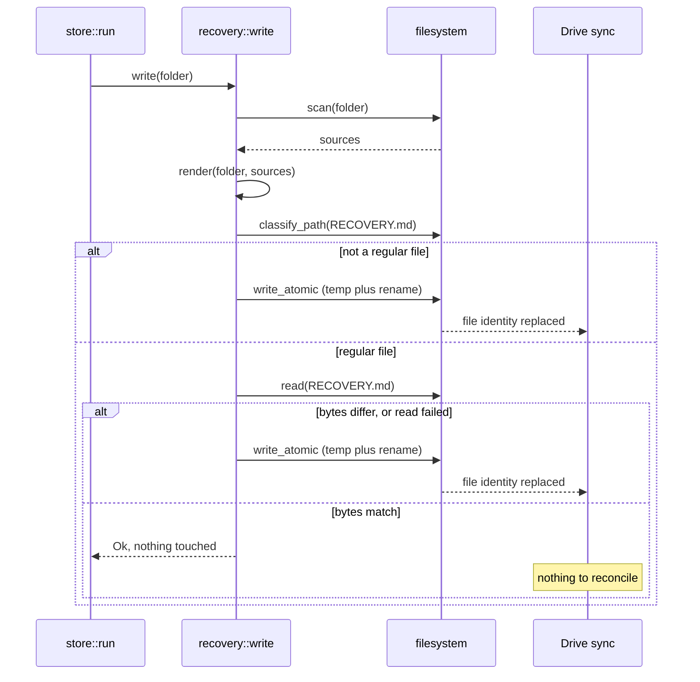

# RFC 002 -- Write `RECOVERY.md` only when it changed

| Field             | Value                                            |
|-------------------|--------------------------------------------------|
| **Status**        | `Implemented`                                    |
| **Ticket**        | `(none)` -- see D4                               |
| **Branch**        | `rfc/recovery-write-when-changed`                |
| **Contract docs** | `docs/architecture/remotes.md`                   |
| **Start date**    | `2026-09-01`                                     |
| **Updated**       | `2026-09-04`                                     |

---

## Summary

`recovery::write` renders `RECOVERY.md` and hands it to `write_atomic`, which writes a
temp file and renames it over the target. It does this on every run, whether or not the
content differs, and the content almost never differs: it is a pure function of the
folder's contents, deliberately free of timestamps. On a Google Drive mount that rename
replaces the file's identity every run, and on 2026-08-27 Drive responded by parking the
displaced copy in `lost_and_found`. This RFC puts a comparison in front of the write, so
an unchanged file is left alone.

---

## Why this RFC, why now

`RECOVERY.md` is the note Tycho writes beside the bare repositories in a remote folder,
holding the plain-git commands to recover from it. `remotes.md` section 2b already
records the property this RFC leans on: the content carries no timestamp, so it is a
pure function of what the scan found, and two concurrent writers converge by
construction. The same property means that when the folder has not changed, the bytes
have not changed, and the write is pure churn.

That churn is not free on a sync-client mount. Google Drive tracks a file by its own
identifier rather than by path. `write_atomic` writes `RECOVERY.md.tmp.<pid>` and
renames it over `RECOVERY.md`, which unlinks the file Drive was tracking and puts a
different one in its place. Drive is conservative about a tracked object losing its
parent: rather than delete it, it moves it to `lost_and_found` and notifies the user.

Observed on this machine:

```text
lost_and_found/104503513857799713997/RECOVERY.md   6397 bytes, 2026-08-27 20:28
```

Byte-identical to the copy in the backup folder (`diff` clean). No git object, pack or
bundle was involved, and no backup data was ever at risk. It has happened once across
13 runs, which reads as a race against Drive's upload of the previous version rather
than a deterministic outcome of every rename.

**Why it can't wait.** Nothing is broken, so the honest why-now is small: this is a
false alarm about the integrity of a backup folder, sent by a backup tool, and the cost
of false alarms is a case this project has already made against itself. `remotes.md`
argues twice that a row which is red on every machine is one people learn to skim, and
that is why `doctor` sweeps sidecars rather than reporting them, and why the Spotlight
check fires only on an unjournaled volume. A Drive notification saying files were moved
out of the backup folder is the same failure at a different layer. The fix is a
comparison in one function.

---

## Scope

### In

- `recovery::write` compares the rendered bytes against what is on disk and skips the
  write when they already match.
- The comparison refuses to skip on anything that is not a regular file, so a symlink
  at the path is still replaced.
- A test that fails without the change.
- `docs/architecture/remotes.md` section 2b records the guard.

### Out (deferred)

- Applying the same guard inside `write_atomic` for its other nine callers. They write
  to local paths where the churn costs nothing, and one is `sys/lock.rs` -- see
  Alternative A.
- Git's own rename-over-existing when a push updates a loose ref in the remote
  repository. Same mechanism, not ours to change, and no ref has ever appeared in
  `lost_and_found`.
- Anything that reaches into Drive's `lost_and_found` or its notifications.

---

## Guide-level explanation

Nothing changes for the caller. `store::run` still writes the file after every push and
still ignores the result, because a recovery note that failed to write is not a reason
to fail a backup that succeeded:

```rust
for folder in &folders {
    let _ = remote::recovery::write(folder);
    remote::sweep_sidecars(folder);
}
```

The difference is on disk. Today the second of two identical runs replaces the file;
after this change it does not touch it. `stat` is the way to see it:

```text
$ tycho push cex && stat -f '%i %m' "$FOLDER/RECOVERY.md"
12904418 1756762380
$ tycho push cex && stat -f '%i %m' "$FOLDER/RECOVERY.md"
12904418 1756762380      # same inode, same mtime
```

---

## Reference-level explanation

### Types / data shapes

`write`'s signature is unchanged, which is the point: the skip is an implementation
detail, not a new contract.

```rust
/// Writes the file, scanning immediately beforehand.
///
/// Skips the write when the rendered bytes already match what is there, so a run
/// that changed nothing does not replace the file. That matters on a sync-client
/// mount, where replacing a file replaces its identity.
///
/// # Errors
///
/// If the file cannot be written.
pub fn write(folder: &Path) -> std::io::Result<()>;

/// True only for a regular file whose bytes already match.
///
/// Any other answer means write: the skip is an optimisation and must never be the
/// reason the file is missing, stale or a symlink.
fn unchanged(path: &Path, bytes: &[u8]) -> bool;
```

### Behaviour and state



The ordering is load-bearing in one place only: `classify_path` before `read`, so a
symlink is decided on before anything follows it.

### Invariants

- After `write` returns `Ok`, the file exists and its bytes equal
  `render(folder, scan(folder))`. The skip preserves this because it is taken only
  when that already holds.
- Self-healing survives. The comparison is against freshly rendered bytes, so a
  truncated, hand-edited or otherwise wrong `RECOVERY.md` differs and is rewritten,
  exactly as the unconditional write did.
- The skip path creates no temp file, so it cannot leave one behind.
- A symlink at the path is never skipped over.
- Concurrent writers still converge. Two runs render identical bytes, so each
  independently either skips or writes the same content.

### Contracts (protocol / trait / interface)

`(none)` -- no trait or port changes. `write` is a free function with one caller.

**Patterns.** Nothing in `~/.claude/guidance/patterns/` fits and none is forced on it.
This is an idempotence guard, named `write-if-changed` in the build-systems literature
(see Prior art). Naming it that way is what makes the design reviewable: the known
failure mode of write-if-changed is a comparison that is cheaper than it looks or wrong
about equality, and both are addressed above.

---

## Migration and rollout

`(not applicable)` -- no persisted data, no schema, no defaults key. The change is
observable only as an mtime and inode that stop advancing on unchanged runs.

**Rollback:** revert the commit. There is no one-way step and nothing to undo on disk;
the next run rewrites the file if it differs and leaves it if it does not.

---

## Edge cases

| Case | Behaviour |
|------|-----------|
| `RECOVERY.md` absent | `classify_path` errors, not skipped, written |
| A repository was added to the folder | Rendered bytes differ, written |
| Hand-edited or truncated file | Bytes differ, written -- self-healing preserved |
| Path is a symlink | Never skipped; `write_atomic`'s rename replaces the link with a real file, as today |
| Path is a directory | Not a regular file, not skipped; the rename fails and reports, as today |
| File unreadable (permissions) | Read fails, not skipped, write proceeds and reports its own error |
| Drive has evicted the file to a cloud-only placeholder | The read pulls it back once per run, 6 KB |
| Two runs writing the same folder concurrently | Unchanged from today: identical bytes, so each skips or writes the same content |
| Remote folder is on exFAT | Unaffected. The AppleDouble sidecar for `RECOVERY.md` is still swept, and one fewer rewrite means one fewer sidecar |

---

## Privacy, security, and cost notes

- **Privacy:** `(none)` -- no new data is collected, read or transmitted. The file
  compared is one Tycho wrote.
- **Security:** the guard is written to be neutral, not merely safe. Skipping on a
  symlink would be a regression, because the current rename replaces a planted link
  with a real file, so `unchanged` returns false for anything that is not a regular
  file. This is the same threat `write_and_sync`'s `create_new` already handles for the
  temp path: a remote folder is a directory other people can write to.
- **Cost / performance:** adds one read of roughly 6 KB per remote folder per run, and
  saves a write, an `fsync` and a rename whenever the content matches. On a network
  mount the read can be slower than the write it replaces, which is the honest tradeoff
  (see Drawbacks). No new network calls of our own, no background work, no hot path.

---

## Drawbacks

- **It adds a read to a path that previously only wrote.** On a Drive mount that read
  can be slower than the write it saves, and if Drive has evicted the file it becomes a
  download. Judged acceptable at 6 KB, once per folder per run, against a daily
  schedule.
- **`RECOVERY.md`'s mtime stops advancing.** Anyone eyeballing the folder to answer
  "when did Tycho last touch this" loses that signal. `tycho status` reports the push
  time and is the real answer, but the folder is meant to be readable without Tycho, so
  this is a genuine small loss.
- **It optimises for one sync client's behaviour** on evidence from a single observed
  incident. If the real cause was something else in Drive, this change does not fix it,
  though it is still correct on its own terms.

---

## Alternatives considered

### A. Put the guard in `write_atomic`, for all ten callers

Every caller would get it for free. Rejected: nine of them write to local paths under
`~/Library/Application Support` and `~/.config`, where replacing a file costs nothing
and no sync client is watching, so they would pay a read for no benefit. One of them is
`sys/lock.rs`, where "skip because the bytes already match" changes the behaviour of a
concurrency primitive, which is not a change to make as a side effect of fixing a
recovery note. The problem is specific to a folder a sync client watches, and
`recovery::write` is the only writer into one.

### B. Write in place -- truncate and rewrite instead of renaming

This is what cargo's `write_if_changed` does, and it would preserve file identity
outright rather than avoiding the rename. Rejected: it gives up atomicity and the
symlink hardening `write_and_sync` was built for. An interrupted in-place write leaves
a half-written `RECOVERY.md`, and this file's whole job is to be readable in a disaster.
A churned file is a better failure than a torn one.

### C. Do nothing

Defensible: nothing is broken, no data was lost, and the incident fired once in 13 runs.
Rejected because the fix is a comparison in one function and the cost of leaving it is
a recurring false alarm about a backup folder, which this project's own docs treat as a
real cost rather than a cosmetic one.

### D. Track the folder's last-written state locally and write only when it changed

Would avoid the read entirely. Rejected: it adds persisted state to save 6 KB of IO,
and the state goes stale the moment anyone touches the file by hand, which is exactly
the case the comparison handles correctly.

---

## Prior art and related work

- **Our platform, on this exact question.** The Rust toolchain we build with already
  ships this function: `cargo_util::paths::write_if_changed`, documented as "equivalent
  to `write()`, but does not write anything if the file contents are identical to the
  given contents". Its source opens the file read-write with `create(true)`, reads it
  whole, and on a difference does `set_len(0)`, seeks to zero and rewrites in place.
  **What this RFC adopts:** the comparison, and the decision to compare bytes rather
  than a hash or a timestamp. **What it deliberately does not adopt:** the in-place
  truncate-and-rewrite, because we keep the atomic rename (Alternative B). Note also
  that cargo propagates a read error as fatal; we fall through to the write instead,
  because for us the write is the correctness path and the skip is the optimisation.
- **What the vendor says, and what it does not.** Google's own documentation states
  only that files which fail to sync are moved to a `lost_and_found` folder, and that
  its contents are deleted when the account is disconnected. It does **not** name
  rename-over-existing as a cause. **That absence is a finding:** the causal link in
  this RFC is inferred from the observation (one file, identical bytes, one run in 13,
  the only rename-over-existing Tycho performs in that folder), not from a documented
  guarantee. The change is worth making either way, since it removes churn that has no
  benefit, but the mechanism should not be written down as vendor-confirmed.
- **How adjacent sync clients draw the same line.** OneDrive and Dropbox respond to an
  identity they cannot reconcile by preserving both sides -- a conflicted copy named
  after the device or account -- rather than deleting either. Drive's `lost_and_found`
  is the same instinct with a different name. The cross-check this gives us is that
  parking a displaced file is normal client behaviour under identity churn, not a Drive
  defect to report.
- **The general problem is idempotent writing**, and the field that owns it is build
  systems, where an unnecessary rewrite advances an mtime and triggers a spurious
  rebuild downstream. The known solutions are the two this RFC weighed: compare content
  before writing, or track state and compare that. Build systems moved from timestamp
  comparison to content hashing for the same reason we compare bytes rather than trust
  an mtime.

---

## Future possibilities

- If anything else is ever written into a remote folder alongside `RECOVERY.md`, the
  same guard is where it belongs, and `unchanged` is already the right shape to reuse.
- If the read ever becomes measurably expensive on a large folder, comparing
  `metadata().len()` first is a cheap pre-filter. Deliberately not done now: at a fixed
  6 KB it would be an optimisation with nothing to show for it.

---

## Decisions (resolved)

### D1. Where the guard lives

Should the comparison go in `write_atomic` or in `recovery::write`?
**Chosen:** `recovery::write` (author, pending owner review). The problem is specific to
a sync-watched folder and `recovery::write` is the only writer into one; widening it
would change `sys/lock.rs`'s semantics as a side effect. Rejected: Alternative A.

### D2. What counts as unchanged

**Chosen:** a regular file whose bytes match exactly (author). Not an mtime, not a
length, not a hash. Bytes are what correctness depends on, the file is 6 KB, and a hash
would be strictly more code for the same answer. Non-regular files never count as
unchanged, so the symlink replacement the rename gives us today is preserved.

### D3. Keep the atomic rename on the write path

**Chosen:** yes (author). The skip removes the rename on unchanged runs, which is the
whole benefit; the changed runs keep the atomicity and the symlink hardening. Rejected:
Alternative B.

### D4. Does this get a tracked ticket?

**Chosen:** no ticket (user). Tycho is not tracked in Linear, so the Ticket row reads
`(none)` deliberately rather than by omission. Was Q1.

---

## Open questions

`(none)` -- Q1 resolved, see D4.

---

## Files that will change

| File                             | Change | Note                                                              |
|----------------------------------|--------|-------------------------------------------------------------------|
| `src/remote/recovery.rs`         | edit   | `write` compares before writing; new private `unchanged`          |
| `src/remote/recovery.rs`         | edit   | test: a second identical write leaves inode and mtime untouched   |
| `docs/architecture/remotes.md`   | edit   | section 2b records the guard and why it is not in `write_atomic`  |
| `docs/rfc/002-recovery-write-when-changed.md` | **NEW** | this RFC                                     |

---

## Verification checklist

### Automated

- [x] `scripts/ci-check.sh` is green, read as a real exit code rather than through a pipe
      -- all six checks pass, `REAL EXIT CODE: 0` read outside a pipe
- [x] A test asserts a second identical `write` does not replace the file, and fails
      without the change -- `a_second_identical_write_leaves_the_file_alone`; with the
      guard removed it fails on `the second write replaced a file it did not need to`
- [x] The existing `two_writers_over_the_same_folder_produce_identical_bytes` test still
      passes unchanged
- [x] A test asserts a differing file is still rewritten (self-healing) --
      `a_file_that_differs_is_rewritten`

### Manual

Run against the live `gdrive` remote with a debug build at
`~/.build_caches/cargo/debug/tycho`, on 2026-09-04. The installed binary was not
replaced, so the scheduled daemon still runs the released code.

- [x] `tycho push cex` twice; `stat -f '%i %m'` on `RECOVERY.md` is identical across the
      second run -- `214974662 1788534633 6452` both times
- [x] Delete `RECOVERY.md`, push, it comes back with correct content -- restored at
      6452 bytes, `diff` clean against the copy taken beforehand
- [x] Corrupt `RECOVERY.md` (truncate it to 18 bytes), push, it is repaired -- back to
      6452 bytes, `diff` clean
- [x] No `RECOVERY.md.tmp.*` left in the folder after any of the above
- [x] A symlink holding the right bytes is still replaced by a regular file -- covered by
      the unit test `a_symlink_holding_the_right_bytes_is_still_replaced`, which exercises
      `write` end to end on a real symlink. **Deliberately not run against the live Drive
      folder:** planting a symlink named `RECOVERY.md` in a sync-watched backup folder is
      the class of thing that produces the `lost_and_found` entry this RFC exists to stop.
- [x] `tycho doctor` reports no artifact rows on the gdrive remote -- `gdrive  ok  all
      refs present, verified`
- [ ] `lost_and_found/104503513857799713997/` is still empty after a week of scheduled
      runs -- **cannot be ticked before merge.** It is empty today, but the daemon runs
      the installed release binary, so the week only starts once this ships and
      `__bootstrap` reinstalls. Carry it as a post-merge observation.

> The `doctor` failures visible during this verification (`agent  fail  exit 1`,
> `schedule  fail  overdue`, `ghost  fail  behind 5 runs`) are the `ghost` USB stick
> having been unplugged since 2026-09-01 and passing its tolerance. Unrelated to this
> change, and present before it.

---

## Sources

- [`cargo_util::paths::write_if_changed`](https://doc.rust-lang.org/nightly/nightly-rustc/cargo_util/paths/fn.write_if_changed.html) -- the documented semantics this RFC adopts
- [`cargo_util::paths` source](https://doc.rust-lang.org/nightly/nightly-rustc/src/cargo_util/paths.rs.html) -- the in-place rewrite this RFC deliberately does not adopt, and its fatal-on-read-error behaviour
- [Fix problems in Drive for desktop](https://support.google.com/drive/answer/2565956?hl=en&co=GENIE.Platform%3DDesktop) -- Google's only statement on `lost_and_found`: files that failed to sync are moved there, and it is cleared when the account is disconnected
- [Files going into Lost and Found](https://support.google.com/drive/thread/266354187/files-going-into-lost-and-found?hl=en) -- user reports of the same behaviour, with no vendor cause given
- [Cloud sync conflicts explained](https://www.digitalcitizen.life/cloud-sync-conflicts-explained-why-files-duplicate-or-overwrite-themselves/) -- OneDrive and Dropbox preserving both sides under unreconcilable identity, the adjacent-platform cross-check
